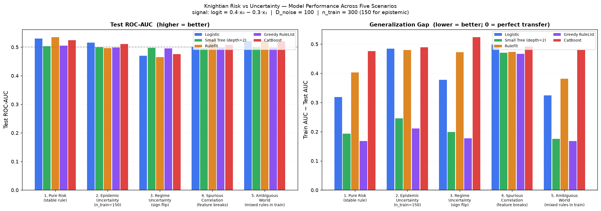
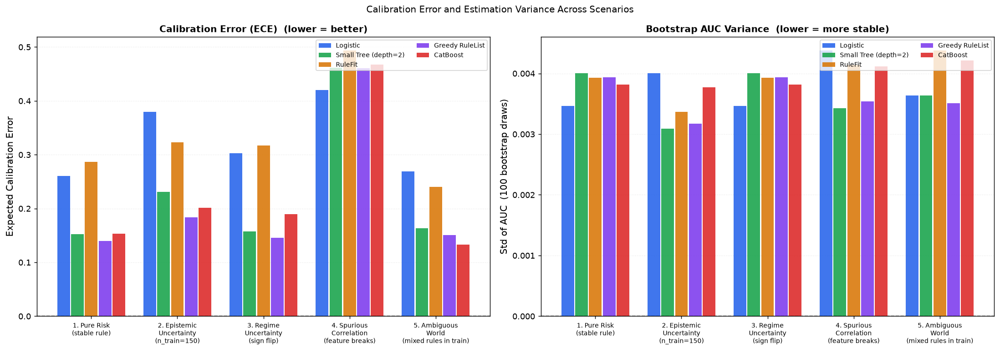
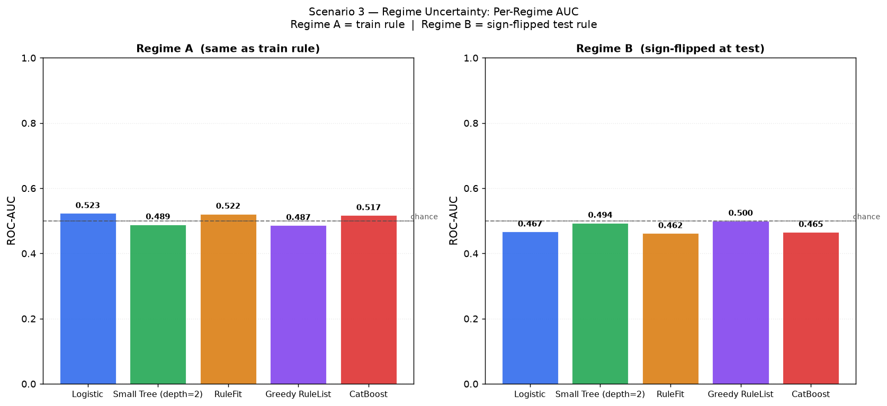
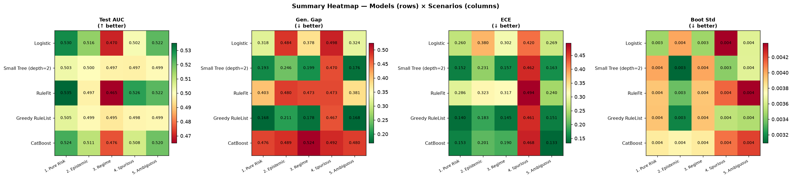
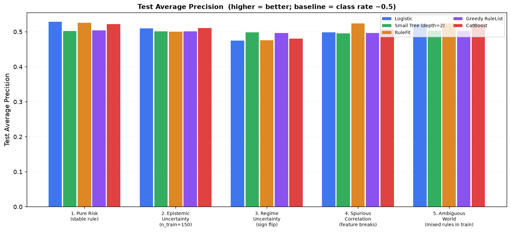

# Knightian Risk vs Uncertainty

> Generated by `experiments/risk_uncertainty/run_experiment.py`

---

## The Core Distinction

**Risk** (Knight, 1921): outcomes follow a *known stable* probability law.
Past data is sufficient to estimate the DGP and deploy confidently.

**Uncertainty**: outcomes follow a law that is *unknown or changing*.
Past patterns may not transfer — because the regime shifted, training was too
small to identify the true rule, or a shortcut feature stops working out-of-sample.

---

## Experimental Design

| Parameter | Value |
| --- | --- |
| n_train | 300 (150 for epistemic scenario) |
| n_test | 20,000 |
| noise features (D_noise) | 100 |
| true signal | `logit = 0.4·x₀ − 0.3·x₁` (weak) |
| prevalence | ≈ 50 % (sigmoid of near-zero logit) |

### Models

| Key | Description |
| --- | --- |
| Logistic | L2-regularised logistic regression (C=1.0) |
| Small Tree | DecisionTreeClassifier, max_depth=2 |
| RuleFit | Sparse linear model over conjunctive rules (imodels) |
| Greedy RuleList | Ordered rule list, max_depth=3 (imodels) |
| CatBoost | Gradient boosting, depth=4, 200 rounds |

---

## Five Scenarios

### Scenario 1 — Pure Risk

**DGP**: same rule `p = sigmoid(0.4·x₀ − 0.3·x₁)` in both train and test.
This is the "known dice" world: historical data is representative of the future.

Under pure risk, complex models are allowed to win if they find the signal.
Generalization gaps should be small (both train and test see the same law).

### Scenario 2 — Epistemic Uncertainty

**DGP**: same rule, but n_train=150 with 100 noise features (150 samples to
identify 1 signal among 102 candidates). Past data exists, but it's too thin
to distinguish the true rule from many competing hypotheses.

High-capacity models exploit noise features that happened to correlate with y
in the tiny training sample. Generalization gap widens.

### Scenario 3 — Regime Uncertainty

**Train**: `p = sigmoid(+0.4·x₀ − 0.3·x₁)`
**Test**:  `p = sigmoid(−0.4·x₀ + 0.3·x₁)` ← sign flip

The hidden regime flips between train and test.  A model that perfectly learned
the train rule will produce predictions *anti-correlated* with the test truth,
yielding AUC < 0.5 — worse than random.

### Scenario 4 — Spurious Correlation

**Train**: `x₁ = 0.8·y + 0.3·ε` (x₁ is a proxy for y, e.g. a leaky feature)
**Test**: `x₁ ~ N(0,1)` — the spurious correlation evaporates.

Models that learn to rely on x₁ will fail at test time. The true signal
(x₀) is available all along, but the spurious shortcut is more salient.

### Scenario 5 — Ambiguous World

**Train**: 50 % of samples from Rule A (`signal on x₀, x₁`) and 50 % from
Rule B (`signal on x₂, x₃`). Both rules fit the training data about equally
well. Test is drawn entirely from Rule A.

A model that happened to learn Rule B will fail. Under uncertainty, you
cannot tell which rule the future will obey — model selection becomes
irreducibly ambiguous.

---

## Results

### Test ROC-AUC

| Model | 1. Pure Risk (stable rule) | 2. Epistemic Uncertainty (n_train=150) | 3. Regime Uncertainty (sign flip) | 4. Spurious Correlation (feature breaks) | 5. Ambiguous World (mixed rules in train) |
| --- | --- | --- | --- | --- | --- |
| Logistic | 0.5298 | 0.5159 | 0.4702 | 0.5016 | 0.5219 |
| Small Tree (depth=2) | 0.5029 | 0.4995 | 0.4971 | 0.4967 | 0.4991 |
| RuleFit | 0.5351 | 0.4970 | 0.4649 | 0.5264 | 0.5220 |
| Greedy RuleList | 0.5047 | 0.4989 | 0.4953 | 0.4981 | 0.4986 |
| CatBoost | 0.5240 | 0.5108 | 0.4760 | 0.5078 | 0.5198 |

### Generalization Gap (Train AUC − Test AUC)

| Model | 1. Pure Risk (stable rule) | 2. Epistemic Uncertainty (n_train=150) | 3. Regime Uncertainty (sign flip) | 4. Spurious Correlation (feature breaks) | 5. Ambiguous World (mixed rules in train) |
| --- | --- | --- | --- | --- | --- |
| Logistic | 0.3185 | 0.4841 | 0.3781 | 0.4981 | 0.3241 |
| Small Tree (depth=2) | 0.1931 | 0.2458 | 0.1990 | 0.4702 | 0.1759 |
| RuleFit | 0.4026 | 0.4800 | 0.4727 | 0.4732 | 0.3810 |
| Greedy RuleList | 0.1683 | 0.2108 | 0.1778 | 0.4671 | 0.1681 |
| CatBoost | 0.4760 | 0.4892 | 0.5240 | 0.4922 | 0.4802 |

### Expected Calibration Error

| Model | 1. Pure Risk (stable rule) | 2. Epistemic Uncertainty (n_train=150) | 3. Regime Uncertainty (sign flip) | 4. Spurious Correlation (feature breaks) | 5. Ambiguous World (mixed rules in train) |
| --- | --- | --- | --- | --- | --- |
| Logistic | 0.2602 | 0.3795 | 0.3024 | 0.4200 | 0.2693 |
| Small Tree (depth=2) | 0.1525 | 0.2311 | 0.1573 | 0.4617 | 0.1635 |
| RuleFit | 0.2864 | 0.3228 | 0.3171 | 0.4939 | 0.2405 |
| Greedy RuleList | 0.1397 | 0.1835 | 0.1454 | 0.4606 | 0.1510 |
| CatBoost | 0.1532 | 0.2011 | 0.1897 | 0.4677 | 0.1331 |

### Bootstrap AUC Std (estimation variance)

| Model | 1. Pure Risk (stable rule) | 2. Epistemic Uncertainty (n_train=150) | 3. Regime Uncertainty (sign flip) | 4. Spurious Correlation (feature breaks) | 5. Ambiguous World (mixed rules in train) |
| --- | --- | --- | --- | --- | --- |
| Logistic | 0.0035 | 0.0040 | 0.0035 | 0.0044 | 0.0036 |
| Small Tree (depth=2) | 0.0040 | 0.0031 | 0.0040 | 0.0034 | 0.0036 |
| RuleFit | 0.0039 | 0.0034 | 0.0039 | 0.0041 | 0.0044 |
| Greedy RuleList | 0.0039 | 0.0032 | 0.0039 | 0.0035 | 0.0035 |
| CatBoost | 0.0038 | 0.0038 | 0.0038 | 0.0041 | 0.0042 |

### Regime Performance Detail (Scenario 3)

| Model | AUC Regime A | AUC Regime B | Worst-Regime AUC |
| --- | --- | --- | --- |
| Logistic | 0.5234 | 0.4669 | 0.4669 |
| Small Tree (depth=2) | 0.4890 | 0.4938 | 0.4890 |
| RuleFit | 0.5215 | 0.4619 | 0.4619 |
| Greedy RuleList | 0.4868 | 0.5000 | 0.4868 |
| CatBoost | 0.5171 | 0.4655 | 0.4655 |

A model that perfectly learned the train rule will score AUC ≈ 1 on Regime A
and AUC < 0.5 on Regime B (its predictions are anti-correlated with truth).
The worst-regime AUC is the key robustness metric under distributional uncertainty.

---

## Figures

### Test ROC-AUC and Generalization Gap

### Calibration Error and Bootstrap Variance

### Regime Performance (Scenario 3)

### Summary Heatmap

### Average Precision

---

## Key Takeaways

1. **Under risk (scenario 1)**: complex models (CatBoost) can exploit weak signal if it
   exists. Simple models are competitive but slightly below capacity.

2. **Under epistemic uncertainty (scenario 2)**: generalization gaps widen for all
   models; complex models tend to overfit noise features more than simple ones.

3. **Under regime uncertainty (scenario 3)**: models that learned the train rule
   accurately achieve **worst** test performance — AUC below chance on Regime B.
   The "best training model" becomes the worst deployment model.

4. **Under spurious correlation (scenario 4)**: models that relied on the shortcut
   feature fail. Interpretable models with fewer free parameters may pick up x₀
   directly; complex models may latch onto the more salient spurious x₁.

5. **Under ambiguity (scenario 5)**: all models are at risk. The 50/50 mixed
   train signal means any model is equally likely to have found Rule A or Rule B.
   Test performance regresses toward chance unless a model happened to find Rule A.

---

*Config: hardcoded constants at top of `run_experiment.py`.*
*Raw scores: `metrics.csv`.*
