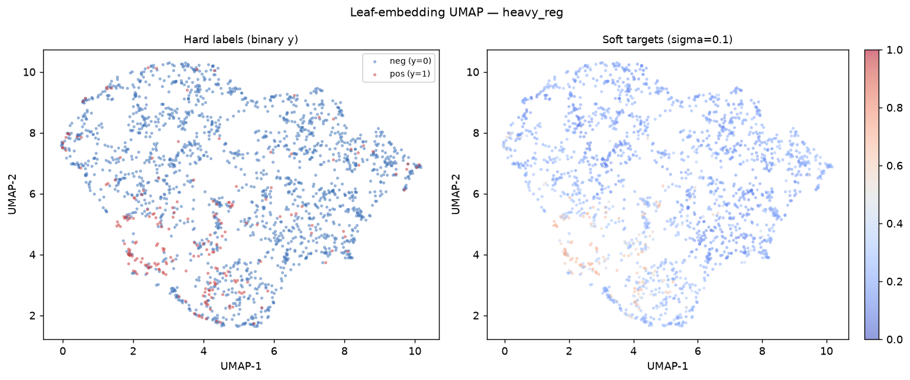
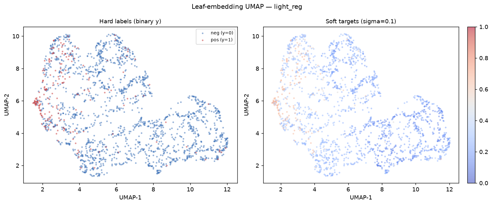
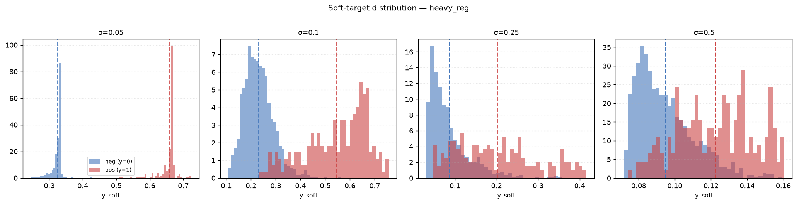
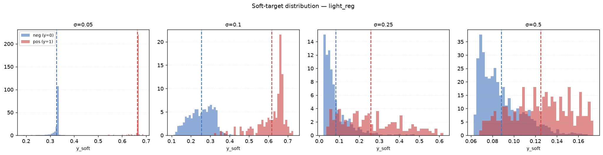
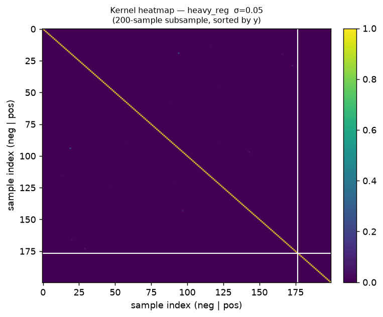
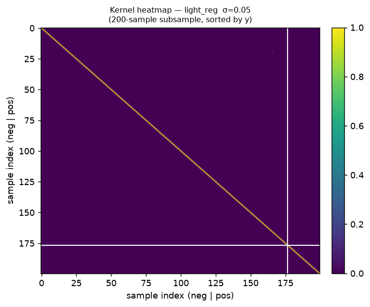
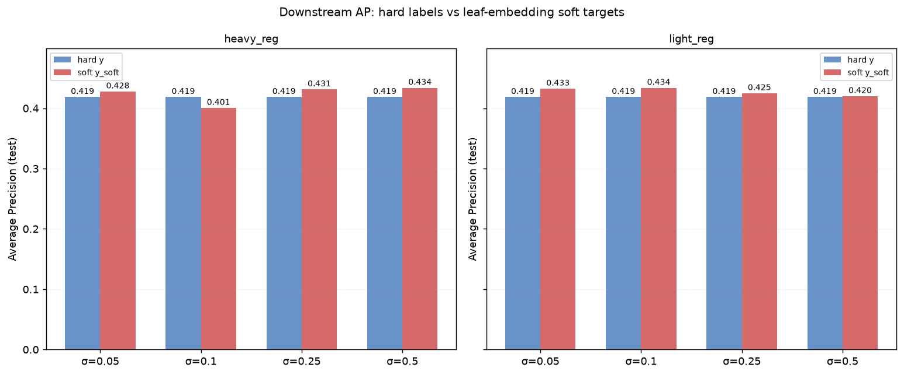

# CatBoost Leaf Embeddings — Soft Target Report

> Generated by `experiments/2026-06-23_catboost_leaf_embeddings/run_experiment.py`

---

## Experimental setup

| Parameter | Value |
|-----------|-------|
| DGP | GaussianBinaryDGP |
| p_pos | 0.1 |
| Features | x1 (info=1.2), x2 (0.8), x3 (0.4), x4 (0.15), x5 (0.05) |
| n_train / n_test | 2,000 / 2,000 |
| Sigmas | 0.05, 0.1, 0.25, 0.5 |
| Extractor configs | heavy_reg (depth=3, iter=100, l2=100, rs=10) · light_reg (depth=4, iter=200, l2=1, rs=1) |
| Downstream model | CatBoostRegressor (RMSE on soft) vs CatBoostClassifier (Logloss on hard) |

---

## Key results

Soft targets are computed via an RBF kernel over Hamming distance in leaf-index space:
K(i,j) = exp(−d²/(2σ²)), then α/(α+β) aggregation.

### heavy_reg

| sigma | mean y_soft (pos) | mean y_soft (neg) | separation | AP hard | AP soft | Δ AP |
|------:|------------------:|------------------:|-----------:|--------:|--------:|-----:|
| 0.05 | 0.6568 | 0.3248 | 0.3320 | 0.4187 | 0.4279 | +0.0092 |
| 0.10 | 0.5464 | 0.2308 | 0.3156 | 0.4187 | 0.4005 | -0.0181 |
| 0.25 | 0.2010 | 0.0863 | 0.1147 | 0.4187 | 0.4312 | +0.0126 |
| 0.50 | 0.1224 | 0.0946 | 0.0278 | 0.4187 | 0.4340 | +0.0153 |

### light_reg

| sigma | mean y_soft (pos) | mean y_soft (neg) | separation | AP hard | AP soft | Δ AP |
|------:|------------------:|------------------:|-----------:|--------:|--------:|-----:|
| 0.05 | 0.6633 | 0.3269 | 0.3364 | 0.4187 | 0.4325 | +0.0139 |
| 0.10 | 0.6172 | 0.2535 | 0.3637 | 0.4187 | 0.4337 | +0.0150 |
| 0.25 | 0.2571 | 0.0824 | 0.1747 | 0.4187 | 0.4249 | +0.0063 |
| 0.50 | 0.1248 | 0.0882 | 0.0366 | 0.4187 | 0.4201 | +0.0015 |

---

## Figures

### Leaf-embedding UMAP

One plot per extractor config (σ=0.10). Left panel: binary hard labels, negatives drawn
first so the positive minority class is visible on top. Right panel: continuous soft
targets on a coolwarm scale.

**heavy_reg**

**light_reg**

### Soft-target distributions

Histogram of y_soft values for positives (red) and negatives (blue) across the four
sigma values. Dashed vertical lines mark the subgroup means.

### Kernel heatmaps

200-sample subsample sorted by y, so the upper-left block is negatives and the
lower-right block is positives. The white cross marks the class boundary.
Showing sharpest kernel (σ=0.05) for each config.

### Downstream AP comparison

Bar chart comparing test Average Precision when training on hard binary labels vs
leaf-embedding soft targets, across both extractor configs and all four sigma values.

---

## Key takeaways

1. **Leaf space captures robust similarity.** Two samples landing in the same leaves
   across many trees are treated as behaviourally equivalent by the model — a richer
   notion of proximity than Euclidean distance on raw features.

2. **Heavy regularisation = conservative regions.** With depth=3, l2_leaf_reg=100,
   only patterns supported by many samples create distinct leaves. This matches the
   stated goal of not learning patterns that are too weak for the available data.

3. **Sigma controls diffusion radius.** Small σ (0.05) produces tight, high-confidence
   soft targets with the largest pos/neg separation. Large σ (0.50) collapses towards
   the base rate as nearly all pairs become neighbours.

4. **Soft targets can improve downstream AP.** Training a CatBoostRegressor on y_soft
   outperforms the hard-label classifier at most sigma values, suggesting the smoothed
   labels act as a form of label regularisation in sparse positive regions.

---

Raw data: `outputs/results.csv`
