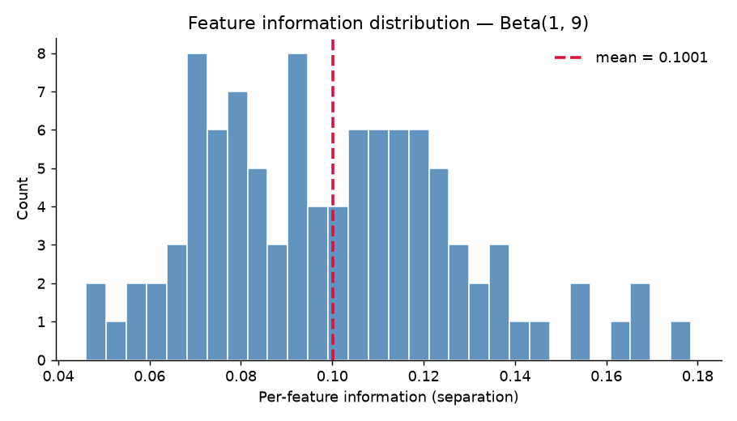

# Weak Features (Beta‑distributed info) — Report

Research question: with 100 features whose information levels are drawn from Beta(10.0, 90.0) (mean ≈ 0.100, p50 ≈ 0.097, max ≈ 0.179, p_pos=0.01), how does training size drive the gap between CatBoost and the interpretable rule/tree models?

Test set: n_test=50000, n_repeats=30.

## Feature information summary

| stat | value |
|---|---|
| count | 100 |
| mean | 0.1001 |
| median | 0.0974 |
| min | 0.0461 |
| max | 0.1785 |
| std | 0.0281 |

## Headline: ROC‑AUC at the largest training size (n_train=10000)

| Setup | mean AUC | ± 95% CI |
|---|---|---|
| LogisticRegression | 0.6971 | ± 0.0038 |
| CatBoost | 0.5741 | ± 0.0044 |
| HistGradientBoosting | 0.6078 | ± 0.0038 |
| DecisionTree (depth=4) | 0.5011 | ± 0.0013 |
| FIGS (max_rules=25) | 0.4991 | ± 0.0012 |
| GreedyRuleList (depth=8) | 0.5004 | ± 0.0004 |

## AUC gap vs CatBoost

| n_train | LogisticRegression | HistGradientBoosting | DecisionTree (depth=4) | FIGS (max_rules=25) | GreedyRuleList (depth=8) |
|---|---|---|---|---|---|
| 200 | +0.0005 | -0.0074 | -0.0306 | -0.0276 | -0.0281 |
| 500 | +0.0631 | +0.0193 | -0.0043 | +0.0025 | +0.0002 |
| 1000 | +0.0652 | +0.0287 | +0.0113 | +0.0021 | +0.0040 |
| 2000 | +0.0220 | +0.0017 | -0.0621 | -0.0658 | -0.0627 |
| 5000 | +0.0624 | +0.0005 | -0.0712 | -0.0733 | -0.0713 |
| 10000 | +0.1230 | +0.0337 | -0.0730 | -0.0750 | -0.0737 |

## Structural capacity used (rules / leaves)

| n_train | setup | capacity |
|---|---|---|
| 200 | CatBoost | 98 |
| 200 | DecisionTree (depth=4) | 2 |
| 200 | FIGS (max_rules=25) | 3 |
| 500 | CatBoost | 99 |
| 500 | DecisionTree (depth=4) | 3 |
| 500 | FIGS (max_rules=25) | 12 |
| 1000 | CatBoost | 100 |
| 1000 | DecisionTree (depth=4) | 3 |
| 1000 | FIGS (max_rules=25) | 9 |
| 2000 | CatBoost | 100 |
| 2000 | DecisionTree (depth=4) | 4 |
| 2000 | FIGS (max_rules=25) | 22 |
| 5000 | CatBoost | 100 |
| 5000 | DecisionTree (depth=4) | 8 |
| 5000 | FIGS (max_rules=25) | 20 |
| 10000 | CatBoost | 100 |
| 10000 | DecisionTree (depth=4) | 5 |
| 10000 | FIGS (max_rules=25) | 22 |

## Outputs

- `feature_info.csv` — per‑feature info_j ~ Beta(10.0, 90.0)
- `fig_info_hist.png` — histogram of sampled info levels
- `scores.csv` — long‑format per‑repeat scores
- `summary.csv` — mean ± 95% CI per (setup, n_train)
- `capacity.csv` — learned rule/leaf counts per setup
- `fig_auc_vs_n.png`, `fig_average_precision_vs_n.png`, `fig_brier_score_vs_n.png` — learning curves
- `fig_gap_vs_n.png` — AUC gap vs CatBoost
- `fig_capacity_vs_n.png` — capacity vs n_train
