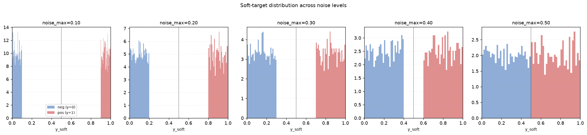
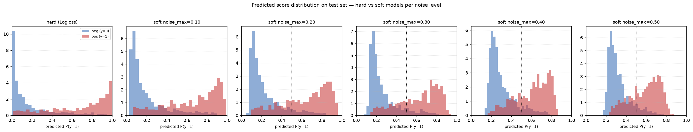
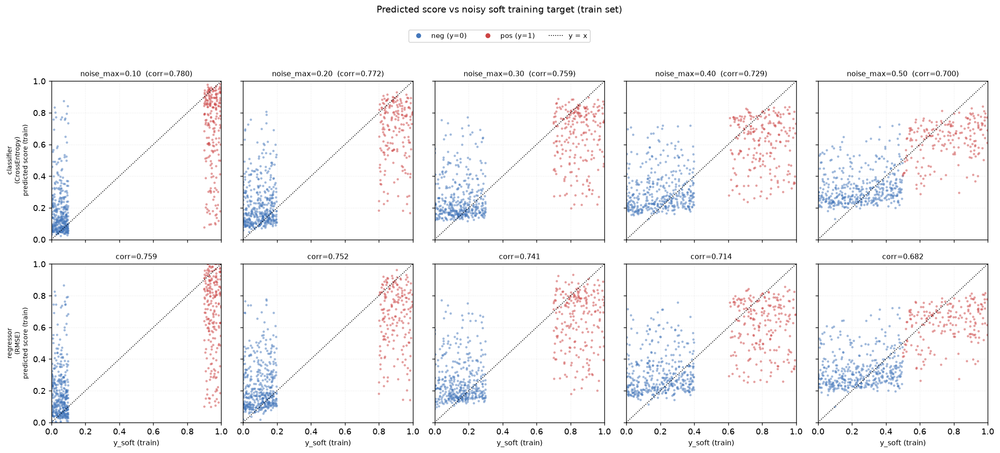
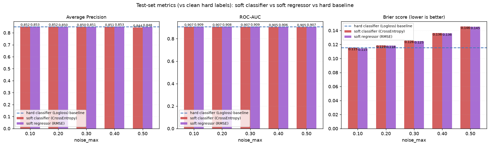
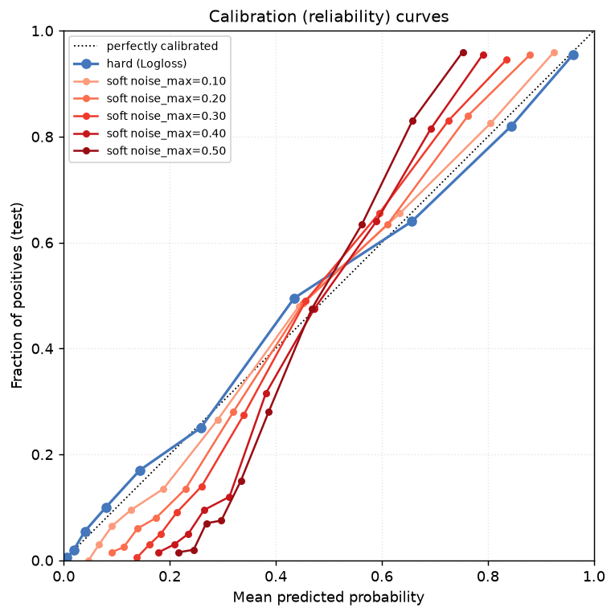
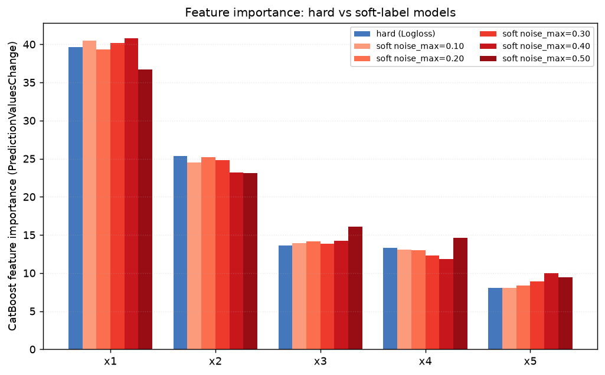
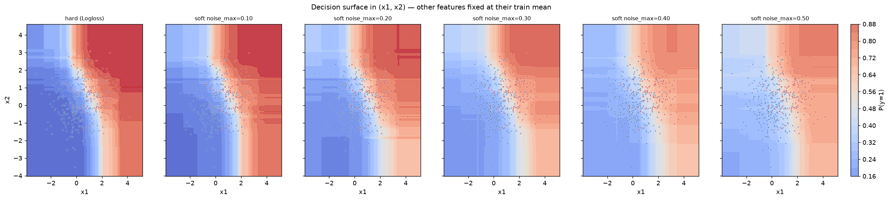
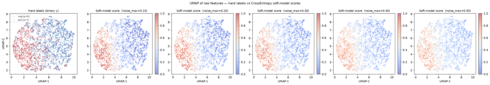

# Noisy Soft Labels — CrossEntropy Report

> Generated by `experiments/noisy_label_catboost/run_experiment.py`

---

## Experimental setup

| Parameter | Value |
|-----------|-------|
| DGP | GaussianBinaryDGP |
| p_pos | 0.35 |
| Features | x1 (info=1.5), x2 (info=1.0), x3 (info=0.6), x4 (info=0.3), x5 (info=0.1) |
| n_train / n_test | 3,000 / 2,000 |
| Noise levels (noise_max) | 0.10, 0.20, 0.30, 0.40, 0.50 |
| Soft target | y_soft = 1-u if y=1 else u,  u ~ Uniform(0, noise_max) |
| Hard model | CatBoostClassifier, loss_function=Logloss, trained on y |
| Soft classifier | CatBoostClassifier, loss_function=CrossEntropy, trained on y_soft |
| Soft regressor | CatBoostRegressor, loss_function=RMSE, trained on y_soft, predictions clipped to [0,1] |
| CatBoost params | {'iterations': 300, 'depth': 4, 'learning_rate': 0.06} |

---

## Key results

All metrics are evaluated on the held-out test set against the clean hard labels — the
soft model never sees a hard label at train time, only the noisy `y_soft`.

### Hard-label baseline (Logloss)

AP = 0.8510  ·  AUC = 0.9072  ·  Brier = 0.1154

### Soft classifier (CrossEntropy) vs noise level

| noise_max | mean y_soft (pos) | mean y_soft (neg) | separation | AP | AUC | Brier | ΔAP vs hard |
|----------:|-------------------:|-------------------:|-----------:|----:|----:|------:|------------:|
| 0.10 | 0.9501 | 0.0498 | 0.9003 | 0.8519 | 0.9071 | 0.1154 | +0.0009 |
| 0.20 | 0.8992 | 0.0999 | 0.7992 | 0.8520 | 0.9068 | 0.1188 | +0.0011 |
| 0.30 | 0.8488 | 0.1486 | 0.7002 | 0.8503 | 0.9072 | 0.1256 | -0.0007 |
| 0.40 | 0.8012 | 0.2048 | 0.5965 | 0.8506 | 0.9050 | 0.1363 | -0.0004 |
| 0.50 | 0.7488 | 0.2460 | 0.5028 | 0.8437 | 0.9049 | 0.1457 | -0.0073 |

### Soft regressor (RMSE) vs noise level

Same `y_soft` targets, but fit with `CatBoostRegressor(loss_function="RMSE")` instead of a
classifier — predictions are clipped to [0, 1] before scoring.

| noise_max | AP | AUC | Brier | Brier: classifier − regressor |
|----------:|----:|----:|------:|-------------------------------:|
| 0.10 | 0.8526 | 0.9087 | 0.1146 | +0.0008 |
| 0.20 | 0.8502 | 0.9082 | 0.1185 | +0.0003 |
| 0.30 | 0.8514 | 0.9087 | 0.1250 | +0.0006 |
| 0.40 | 0.8528 | 0.9065 | 0.1361 | +0.0002 |
| 0.50 | 0.8484 | 0.9071 | 0.1455 | +0.0003 |

---

## Figures

### Soft-target distributions

Histogram of `y_soft` for positives (red) and negatives (blue) across noise levels. Note
that `y_soft` never crosses 0.5 — the noise corrupts confidence, not the class sign.

### Predicted score distributions (test set)

Histogram of each model's predicted P(y=1) on the held-out test set, split by the true
hard label, for the hard baseline and every soft noise level. Unlike the panel above (which
shows the noisy *training* targets), this shows what the model actually outputs — the
pos/neg histograms visibly move closer together as noise_max grows.

### Score vs soft training target

Scatter of each model's own predicted score against the noisy `y_soft` it was trained on
(train set, 600-point subsample, coloured by the true hard label). Top row: classifier
(CrossEntropy). Bottom row: regressor (RMSE). The dotted line is `y = x` — points hugging
it means the model just memorised the noise; points collapsing toward two horizontal bands
(one per class) mean the model denoised `y_soft` back toward the true class probability.
The `corr` annotation is the Pearson correlation between predicted score and `y_soft`.

### Metric comparison — classifier vs regressor

Bar chart of AP / AUC / Brier for the soft classifier (CrossEntropy) vs the soft regressor
(RMSE), both trained on the same noisy `y_soft`, at each noise level, against the hard
(Logloss) baseline (dashed line). The Brier panel is the direct answer to "does it matter
whether you treat the soft target as a classification or a regression problem?"

### Calibration curves

Reliability diagram (10 quantile bins) on the test set. The hard-label model tracks the
diagonal; soft-label curves flatten toward the middle as `noise_max` grows — a direct
picture of the calibration compression quantified by the Brier column above.

### Feature importance

CatBoost `PredictionValuesChange` importance per feature, hard model vs each soft model.
If CrossEntropy training on noisy targets is behaving sensibly, the ranking of features by
importance should stay stable across noise levels even as absolute magnitudes shift.

### Decision surface

Predicted P(y=1) over the (x1, x2) plane — the two strongest-information features — with
x3-x5 fixed at their training mean. 400 training points overlaid (red=pos, blue=neg). Shows
whether the learned boundary itself shifts with noise, independent of the ranking metrics.

### UMAP — raw features

UMAP of the 5 raw features (fit once). Left panel: hard binary labels. Remaining
panels: predicted probability from the CrossEntropy soft model trained at each noise
level, evaluated on the same training points.

---

## Key takeaways

1. **CrossEntropy tolerates confidence noise well.** Because `y_soft` always stays on the
   correct side of 0.5, the soft model is learning a *label-smoothing*-style target, not a
   corrupted one — ranking metrics (AP, AUC) stay close to the hard-label baseline even at
   noise_max=0.50.

2. **Calibration degrades before ranking does.** As noise_max grows, predicted probabilities
   are compressed toward 0.5 (the model matches the *expected* soft target, which shrinks
   toward 0.5 as noise grows), so Brier score worsens faster than AP/AUC — visible directly
   in the calibration curves flattening toward the horizontal.

3. **The `separation` column tracks the theoretical decay.** `mean_y_soft_pos -
   mean_y_soft_neg` shrinks linearly from ~0.90 to ~0.50 as noise_max goes from 0.10 to
   0.50 (matches `1 - noise_max`), and the UMAP score panels visibly desaturate toward
   grey (0.5) in step with it — the model's confidence output mirrors the label noise it
   was trained on, even though its ranking of examples barely moves.

4. **The decision surface and feature ranking are largely noise-invariant.** The contour
   shape in (x1, x2) and the relative ordering of feature importances stay close to the
   hard-label model across all noise levels — the noise mainly rescales confidence, it
   doesn't relocate the boundary or change which features the model leans on.

5. **Classifier (CrossEntropy) vs regressor (RMSE) on the same soft target: regressor has the lower (better) Brier score at 5/5 noise levels.** Brier score is itself a proper scoring rule for a
   [0,1]-valued target, and RMSE's population-optimal predictor is the conditional mean —
   exactly what CrossEntropy also targets when the label is a soft probability rather than
   a hard 0/1. So the two losses share the same population optimum; the
   mean |Δ Brier| across noise levels is 0.0004
   here, consistent with optimisation-level noise rather than a systematic advantage for
   either loss.

---

Raw data: `outputs/results.csv`
