# Leaf-Embedding Perturbation Ranking — Report

> Generated by `experiments/leaf_embedding_ranking/run_experiment.py`

---

## Experimental setup

| Parameter | Value |
|-----------|-------|
| DGP | GaussianBinaryDGP |
| p_pos | 0.1 |
| Features | x1 (info=1.2), x2 (0.8), x3 (0.4), x4 (0.15), x5 (0.05) |
| n_train / n_test | 2,000 / 2,000 |
| Lambdas | 0.0, 0.05, 0.1, 0.25 |
| Ridge alpha | 10.0 |
| Tie-breaker epsilon | 1e-06 |
| Extractor configs | heavy_reg (depth=3, iter=100, l2=100, rs=10) · light_reg (depth=4, iter=200, l2=1, rs=1) |
| Downstream model | CatBoostRegressor (RMSE on y_soft) vs CatBoostClassifier (Logloss on hard y) |

---

## Formula

```
p0(x)      = regularized CatBoost probability
L(x)       = model.calc_leaf_indexes(x)           (leaf index per tree)
E(x)       = onehot(L(x))
r(x)       = y(x) - p0(x)                          (train-set residual)
r_hat(x)   = Ridge(E(x))                           (fit on r, train only)
H(x)       = logit(p0(x))
             + lambda * zscore(r_hat(x))
             + epsilon * zscore(E(x) @ w)          (deterministic tie-breaker)
y_soft(x)  = F_train(H(x))                         (train-fit empirical CDF)
```

`zscore` uses train-set mean/std; `F_train` is a Hazen-plotting-position ECDF
fit on train `H` values and applied to both train and test via linear
interpolation — no test-set statistics ever enter the fit.

---

## Key results

**Caveat on degeneracy counts**: this DGP (`GaussianBinaryDGP`) draws continuous
Gaussian features, so raw CatBoost probabilities are almost always distinct at
float64 precision even before any perturbation — literal ties only occur when two
rows land in the exact same leaf of every single tree. The `dup p0` columns below are
therefore already close to `n_test`. The degeneracy-lifting benefit of leaf-embedding
perturbation is expected to matter far more with discrete/categorical or heavily
quantized features, where raw CatBoost scores collapse onto a small set of repeated
values. What this synthetic setup *does* cleanly demonstrate is that the perturbation
preserves ranking (Spearman) while still moving individual scores — see the scatter
plots below.

### heavy_reg

Ridge residual fit: R² train = 0.3612, R² test = 0.0025  (corr train = 0.6055, corr test = 0.2698)  — 690 one-hot leaf features vs 2000 train rows.

| lambda | Spearman(H, logit p0) | dup p0 | dup H | dup y_soft | AP hard | AP raw p0 | AP soft | ΔAP (soft − hard) |
|-------:|-----------------------:|-------:|------:|-----------:|--------:|----------:|--------:|--------------------:|
| 0.00 | 1.0000 | 1999 | 1999 | 1997 | 0.4187 | 0.4234 | 0.3801 | -0.0385 |
| 0.05 | 0.9901 ⚠ | 1999 | 1999 | 1999 | 0.4187 | 0.4234 | 0.4001 | -0.0186 |
| 0.10 | 0.9623 | 1999 | 1999 | 1999 | 0.4187 | 0.4234 | 0.3965 | -0.0222 |
| 0.25 | 0.8186 ⚠ | 1999 | 1999 | 1998 | 0.4187 | 0.4234 | 0.4242 | +0.0055 |

### light_reg

Ridge residual fit: R² train = 0.6529, R² test = -0.3589  (corr train = 0.8305, corr test = -0.0012)  — 2482 one-hot leaf features vs 2000 train rows.

| lambda | Spearman(H, logit p0) | dup p0 | dup H | dup y_soft | AP hard | AP raw p0 | AP soft | ΔAP (soft − hard) |
|-------:|-----------------------:|-------:|------:|-----------:|--------:|----------:|--------:|--------------------:|
| 0.00 | 1.0000 | 2000 | 2000 | 2000 | 0.4187 | 0.4347 | 0.4207 | +0.0020 |
| 0.05 | 0.9993 ⚠ | 2000 | 2000 | 2000 | 0.4187 | 0.4347 | 0.4160 | -0.0027 |
| 0.10 | 0.9972 ⚠ | 2000 | 2000 | 2000 | 0.4187 | 0.4347 | 0.4184 | -0.0003 |
| 0.25 | 0.9832 | 2000 | 2000 | 2000 | 0.4187 | 0.4347 | 0.4007 | -0.0180 |

---

## Figures

### H vs logit(p0) scatter

Perturbed score `H` (y-axis) against the coarse `logit(p0)` (x-axis) on the test
set, per config and lambda. Points hugging the `y=x` line indicate ordering is
preserved; vertical spread at a fixed x value shows ties being broken. Title
reports the Spearman correlation (target band 0.95–0.99 for lambda > 0).

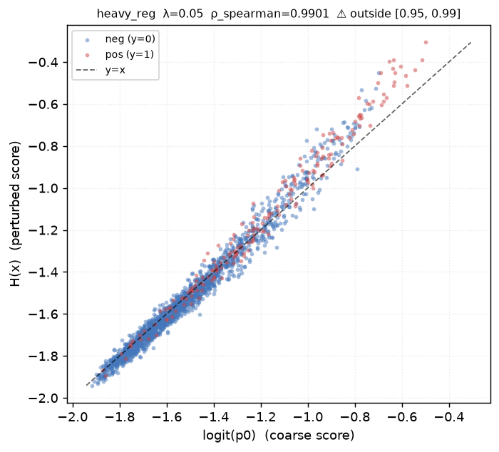

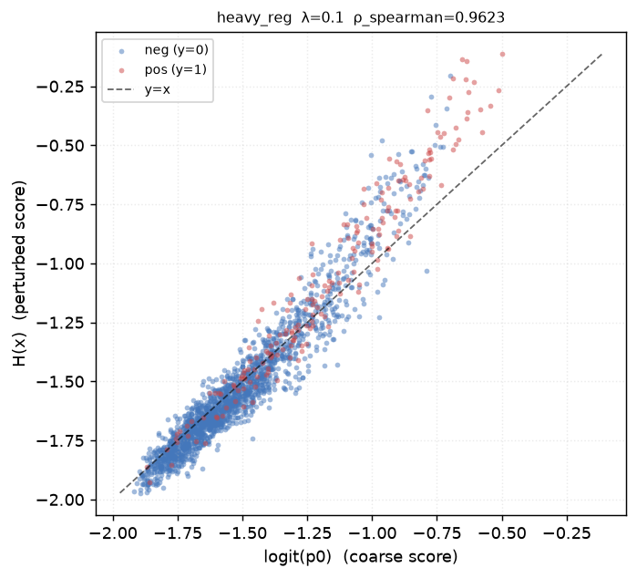

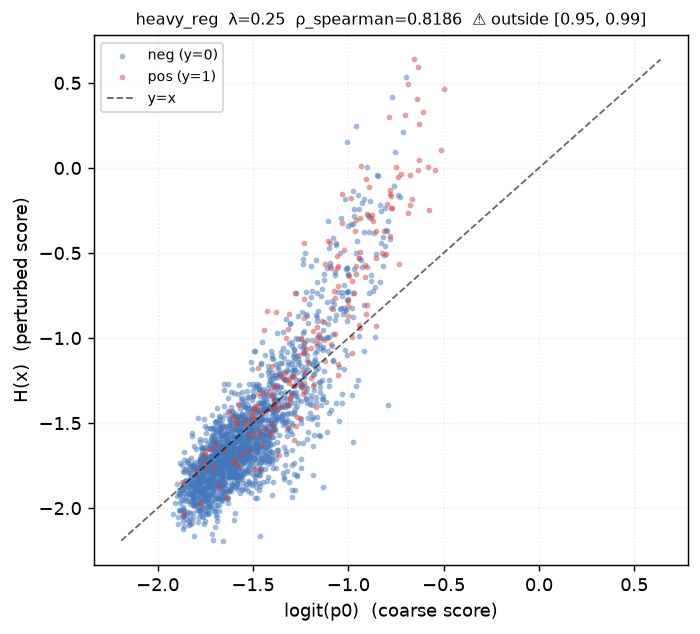

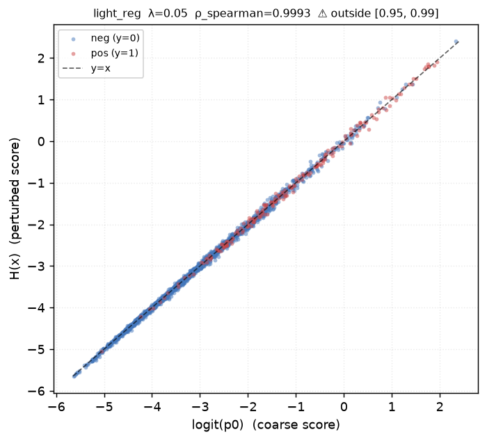

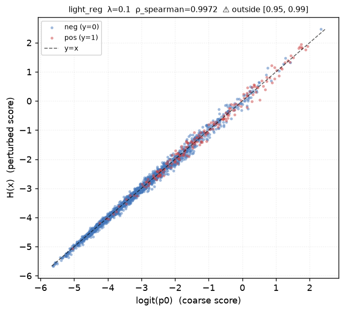

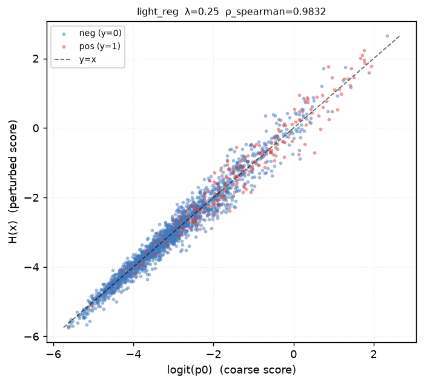

### Score distributions

Histograms of `p0` (raw coarse score), `H` (post-perturbation), and `y_soft`
(post-spreading), split by class. Showing the largest lambda (0.25) per config
— where the perturbation effect is most visible.

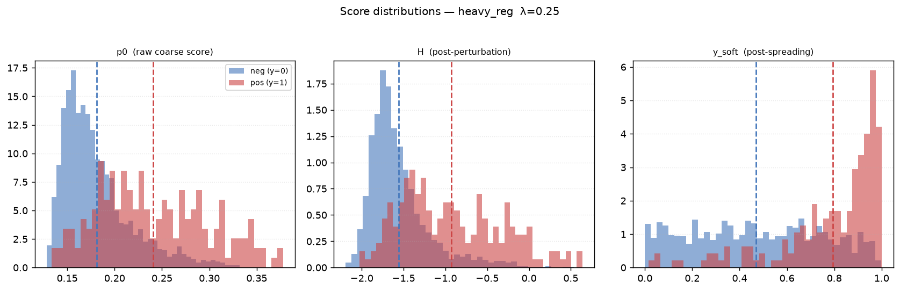

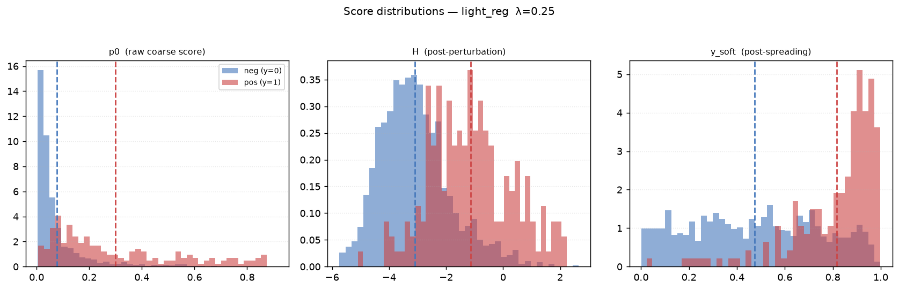

### Degeneracy lifting

Fraction of unique values (out of the test set) for `p0`, `H`, and `y_soft`,
across every (config, lambda) combination.

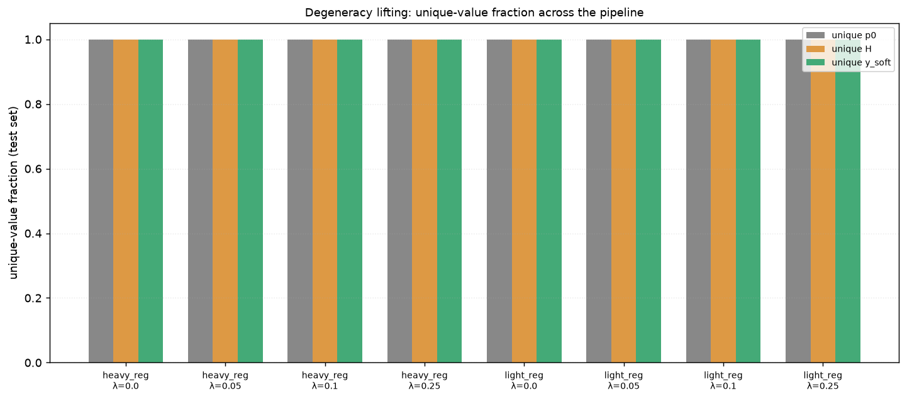

### Downstream AP comparison

Test Average Precision: retraining on hard labels vs the raw coarse `p0` with
no retraining vs retraining on `y_soft`.

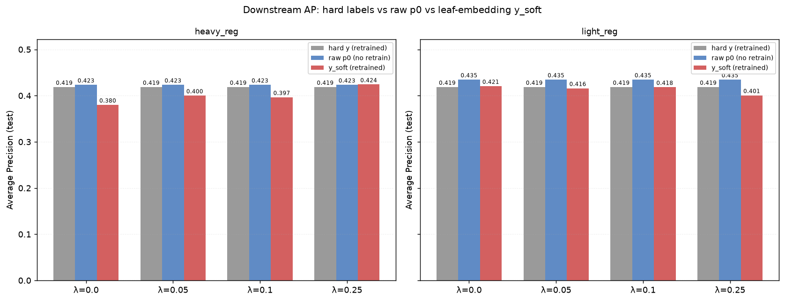

### Ridge residual-fit quality

R² of the Ridge residual model on train vs test, per extractor config.

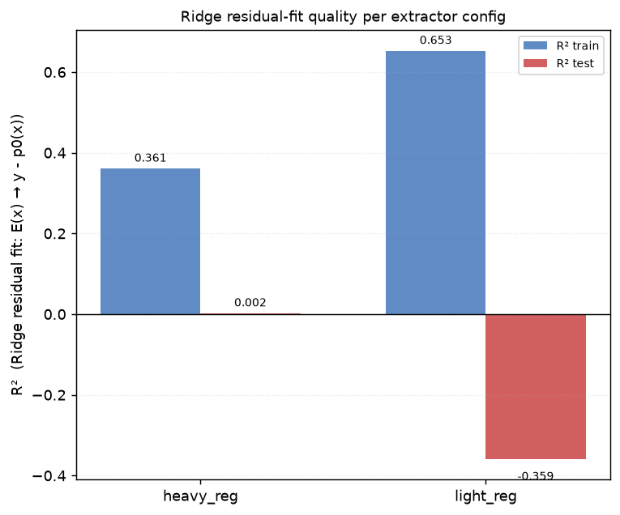

---

## Key takeaways

- **heavy_reg**: Spearman(H, logit p0) fell outside [0.95, 0.99] for 2/3 nonzero-lambda rows — inspect the scatter plots for that config.
  Unique test-set values grew from 1999 (raw p0) to 1998 (y_soft, λ=0.25) out of 2000 rows.
- **light_reg**: Spearman(H, logit p0) fell outside [0.95, 0.99] for 2/3 nonzero-lambda rows — inspect the scatter plots for that config.
  Unique test-set values grew from 2000 (raw p0) to 2000 (y_soft, λ=0.25) out of 2000 rows.
  ⚠ Ridge R² test = -0.3589 (negative) — the one-hot leaf embedding (2482 columns) approaches or exceeds n_train (2000), so the residual model overfits train despite L2 regularization.

---

Raw data: `results.csv`
