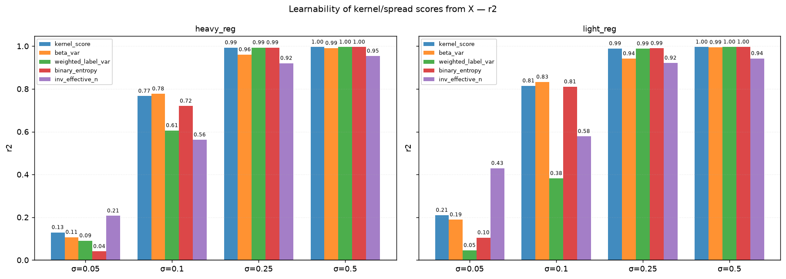
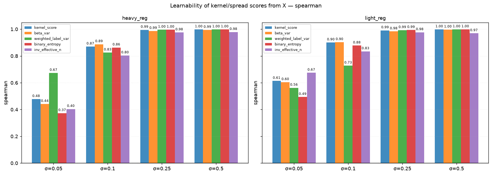
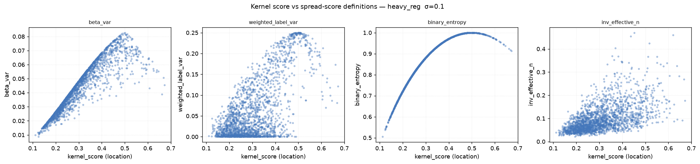
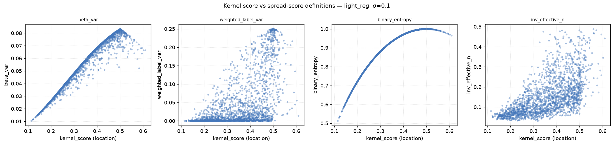
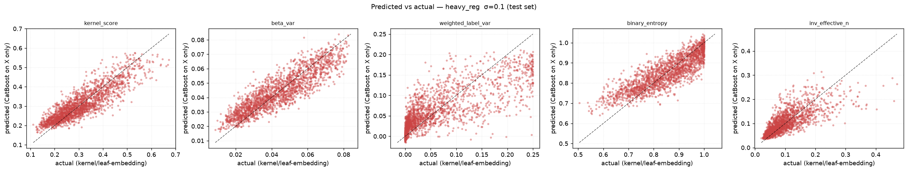
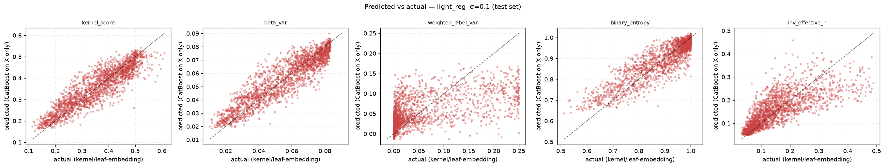

# Spread Score — Learnability Report

> Generated by `experiments/2026-07-02_spread_score/run_experiment.py`

---

## Question

`experiments/2026-06-23_catboost_leaf_embeddings` showed the *kernel score* (a kernel-weighted
vote over neighbour labels in leaf-embedding space) is a useful soft target. This
experiment asks the follow-up: can we also define a **spread score** — how much
neighbours disagree, not just what they agree on — and is that quantity itself a
smooth, learnable function of the raw features X? If a CatBoostRegressor trained
directly on X can recover the kernel-derived spread score, the notion of local
uncertainty generalises beyond the training neighbourhood and could be used as a
cheap inference-time feature (no leaf embeddings / kernel needed at serving time).

---

## Experimental setup

| Parameter | Value |
|-----------|-------|
| DGP | GaussianBinaryDGP |
| p_pos | 0.1 |
| Features | x1 (info=1.2), x2 (0.8), x3 (0.4), x4 (0.15), x5 (0.05) |
| n_train / n_test | 2,000 / 2,000 |
| Sigmas | 0.05, 0.1, 0.25, 0.5 |
| Extractor configs | heavy_reg (depth=3, iter=100, l2=100, rs=10) · light_reg (depth=4, iter=200, l2=1, rs=1) |
| Downstream learner | CatBoostRegressor(iterations=200, depth=4, lr=0.06, RMSE) trained on raw X only |

Ground-truth scores for both train and test rows are computed from the kernel
against the **training labels only** (self excluded on the train side), so test-set
targets never leak test labels — they are a well-defined nonparametric function of X.

---

## Spread-score definitions

| Name | Formula | Intuition |
|------|---------|-----------|
| `kernel_score` | α/(α+β) | location — kernel-weighted vote (baseline, not a spread measure) |
| `beta_var` | αβ / [(α+β)²(α+β+1)] | posterior variance of a Beta(α,β) fit to the vote |
| `weighted_label_var` | Σ w(y−p̄)² / Σw | model-free kernel-weighted variance of neighbour labels |
| `binary_entropy` | −p·log₂p − (1−p)·log₂(1−p) | uncertainty of the kernel score treated as Bernoulli p |
| `inv_effective_n` | 1 / (1 + Kish ESS) | evidence dilution — large when kernel mass isn't concentrated on real neighbours |

α = 1 + Σ K·1[y=1], β = 1 + Σ K·1[y=0] (Laplace-smoothed kernel-weighted counts).

---

## Learnability results

R² and Spearman ρ between the CatBoost-on-X prediction and the kernel-derived
ground truth, evaluated on the held-out test set.

### heavy_reg

| score_type | sigma | R² | Spearman ρ |
|------------|------:|---:|-----------:|
| beta_var | 0.05 | 0.1069 | 0.4413 |
| beta_var | 0.10 | 0.7772 | 0.8873 |
| beta_var | 0.25 | 0.9605 | 0.9867 |
| beta_var | 0.50 | 0.9905 | 0.9944 |
| binary_entropy | 0.05 | 0.0404 | 0.3729 |
| binary_entropy | 0.10 | 0.7202 | 0.8627 |
| binary_entropy | 0.25 | 0.9933 | 0.9957 |
| binary_entropy | 0.50 | 0.9958 | 0.9976 |
| inv_effective_n | 0.05 | 0.2068 | 0.4039 |
| inv_effective_n | 0.10 | 0.5621 | 0.8038 |
| inv_effective_n | 0.25 | 0.9203 | 0.9755 |
| inv_effective_n | 0.50 | 0.9538 | 0.9785 |
| kernel_score | 0.05 | 0.1293 | 0.4779 |
| kernel_score | 0.10 | 0.7665 | 0.8697 |
| kernel_score | 0.25 | 0.9930 | 0.9948 |
| kernel_score | 0.50 | 0.9959 | 0.9976 |
| weighted_label_var | 0.05 | 0.0905 | 0.6732 |
| weighted_label_var | 0.10 | 0.6058 | 0.8251 |
| weighted_label_var | 0.25 | 0.9933 | 0.9958 |
| weighted_label_var | 0.50 | 0.9959 | 0.9975 |

### light_reg

| score_type | sigma | R² | Spearman ρ |
|------------|------:|---:|-----------:|
| beta_var | 0.05 | 0.1886 | 0.6042 |
| beta_var | 0.10 | 0.8326 | 0.9027 |
| beta_var | 0.25 | 0.9417 | 0.9832 |
| beta_var | 0.50 | 0.9943 | 0.9967 |
| binary_entropy | 0.05 | 0.1049 | 0.4935 |
| binary_entropy | 0.10 | 0.8102 | 0.8775 |
| binary_entropy | 0.25 | 0.9896 | 0.9936 |
| binary_entropy | 0.50 | 0.9964 | 0.9982 |
| inv_effective_n | 0.05 | 0.4291 | 0.6743 |
| inv_effective_n | 0.10 | 0.5784 | 0.8342 |
| inv_effective_n | 0.25 | 0.9213 | 0.9767 |
| inv_effective_n | 0.50 | 0.9425 | 0.9690 |
| kernel_score | 0.05 | 0.2098 | 0.6135 |
| kernel_score | 0.10 | 0.8148 | 0.9006 |
| kernel_score | 0.25 | 0.9888 | 0.9910 |
| kernel_score | 0.50 | 0.9961 | 0.9980 |
| weighted_label_var | 0.05 | 0.0452 | 0.5622 |
| weighted_label_var | 0.10 | 0.3819 | 0.7275 |
| weighted_label_var | 0.25 | 0.9882 | 0.9924 |
| weighted_label_var | 0.50 | 0.9963 | 0.9981 |

---

## Figures

### Learnability — R²

### Learnability — Spearman ρ

### Kernel score vs spread-score definitions (sanity check)

If spread genuinely reflects label disagreement, it should peak near kernel_score ≈
0.5 (maximum class overlap) and shrink toward the extremes. Shown at σ=0.10.

### Predicted vs actual (test set, σ=0.10)

---

## Key takeaways

1. **Sigma dominates learnability, for every definition.** At the tightest kernel
   (σ=0.05) every score is hard to recover from X alone (R² 0.04–0.43). By σ=0.25–0.50
   every definition exceeds R²=0.92, most above 0.99. Bandwidth — not the choice of
   spread formula — is the first-order knob controlling whether a score is learnable.

2. **Spread is not inherently harder to learn than location.** At σ=0.05,
   `inv_effective_n` has *higher* R² than `kernel_score` in both extractor configs
   (0.21 vs 0.13 heavy_reg; 0.43 vs 0.21 light_reg), and rank correlation for at least
   one spread definition (`inv_effective_n` under light_reg, `weighted_label_var` under
   heavy_reg) beats `kernel_score`'s. Local disagreement patterns can align with X even
   when the precise soft-label value is still noisy.

3. **Entropy of the mean is the hardest quantity to learn at tight kernels**, despite
   being a deterministic transform of `kernel_score`. Because entropy is most sensitive
   near p≈0.5, small regression error in the underlying probability gets amplified
   nonlinearly — `binary_entropy` has the lowest R² of all five scores at σ=0.05 in
   both configs.

4. **`beta_var` tracks `kernel_score` almost exactly at σ=0.10** (R² 0.77–0.83 for both,
   in both configs) since it's a smooth deterministic function of the same α/β
   pseudo-counts that produce the kernel score — the Beta-posterior view of spread
   inherits the location statistic's learnability for free.

5. **σ≈0.10 is the practical sweet spot.** It's small enough that scores still carry
   local information (per the pos/neg separation numbers in
   `experiments/2026-06-23_catboost_leaf_embeddings/report.md`), yet large enough that every definition is
   reasonably learnable directly from X (R² 0.56–0.83) — well short of the ≥0.92
   ceiling at larger σ, which is reached mostly by the kernel washing local structure
   out into a low-variance near-constant.

---

Raw data: `outputs/results.csv`
