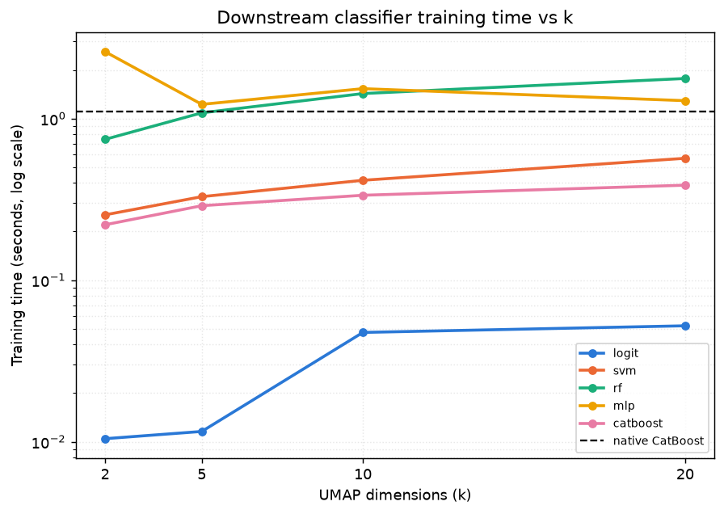

# Leaf-Embedding UMAP Reduction vs Native CatBoost

> Generated by `experiments/2026-07-22_leaf_embedding_umap/run_experiment.py`

---

## Experimental setup

| Parameter | Value |
|-----------|-------|
| DGP | GaussianBinaryDGP + ShiftedDGP (fixed-edge binning) |
| p_pos | 0.05 |
| Numeric features | num_x1 (info=1.2), num_x2 (info=0.6), num_x3 (info=0.2) |
| Categorical features | cat_x1 (info=1.0), cat_x2 (info=0.5), cat_x3 (info=0.1) |
| n_train / n_test | 4,000 / 4,000 |
| Leaf-extractor CatBoost | iterations=300, depth=6, lr=0.05 |
| Trees / leaf-embedding dimensionality | 300 |
| Leaf embedding | raw per-tree leaf indices (no one-hot) |
| UMAP metric | Hamming |
| k values | 2, 5, 10, 20 |
| Downstream classifiers | logit, svm, rf, mlp, catboost |

---

## Native CatBoost baseline (trained on raw features)

| Metric | Value |
|--------|------:|
| ROC-AUC | 0.8512 |
| Average Precision | 0.3555 |
| Training time (s) | 1.1028 |

---

## UMAP + downstream classifier results

| k | classifier | ROC-AUC | Average Precision | Training time (s) |
|--:|------------|--------:|-------------------:|-------------------:|
| 2 | catboost | 0.8527 | 0.3556 | 0.2203 |
| 2 | logit | 0.7608 | 0.1297 | 0.0104 |
| 2 | mlp | 0.8021 | 0.3050 | 2.5966 |
| 2 | rf | 0.7722 | 0.2534 | 0.7444 |
| 2 | svm | 0.5609 | 0.0604 | 0.2537 |
| 5 | catboost | 0.8461 | 0.3508 | 0.2891 |
| 5 | logit | 0.7859 | 0.1635 | 0.0116 |
| 5 | mlp | 0.8541 | 0.3569 | 1.2257 |
| 5 | rf | 0.7998 | 0.2770 | 1.0862 |
| 5 | svm | 0.6897 | 0.2124 | 0.3288 |
| 10 | catboost | 0.8434 | 0.3576 | 0.3355 |
| 10 | logit | 0.7708 | 0.1417 | 0.0475 |
| 10 | mlp | 0.8535 | 0.3625 | 1.5334 |
| 10 | rf | 0.7867 | 0.2775 | 1.4299 |
| 10 | svm | 0.4992 | 0.0634 | 0.4153 |
| 20 | catboost | 0.8405 | 0.3354 | 0.3873 |
| 20 | logit | 0.7831 | 0.2272 | 0.0522 |
| 20 | mlp | 0.8606 | 0.3609 | 1.2918 |
| 20 | rf | 0.7782 | 0.2594 | 1.7727 |
| 20 | svm | 0.7394 | 0.2592 | 0.5683 |

---

## Figures

### Metric vs k

ROC-AUC and Average Precision for each downstream classifier across k, with the
native CatBoost baseline shown as a dashed reference line.

### Training time vs k

Wall-clock fit time (log scale) for each downstream classifier across k, with the
native CatBoost baseline's fit time shown as a dashed reference line.

### UMAP scatter (k=2)

2D leaf-embedding UMAP projection of the test set, colored by label. Negatives
drawn first so the minority positive class is visible on top.

---

## Key takeaways

1. **An MLP model trained on just a 10-D UMAP projection of the leaf embedding nearly matches the native baseline** (AP 0.3625 vs 0.3555, AUC 0.8535 vs 0.8512) — most of the information CatBoost's trees encode about the categorical+numerical feature mix survives a drastic compression from 300 raw leaf indices down to 10 continuous dimensions.

2. **Classifier choice on top of the UMAP embedding matters, and it doesn't rank the way model complexity alone would predict.** Averaged across k, ROC-AUC ranks catboost (0.846) > mlp (0.843) > rf (0.784) > logit (0.775) > svm (0.622). Nonlinear models generally lead, but the gap between them is not fixed — e.g. an RBF-kernel SVM on raw (unscaled) UMAP coordinates is inconsistent across k, sometimes falling behind plain logistic regression.

3. **Diminishing/non-monotonic returns to higher k.** Performance does not improve monotonically with k for any downstream classifier — a 2-D Hamming-metric UMAP embedding already captures most of the leaf-membership signal relevant to the label, and additional dimensions mostly add noise for the downstream fit rather than new signal.

4. **Training-time tradeoff.** Averaged across k, fit time ranks logit (0.030s) < catboost (0.308s) < svm (0.392s) < rf (1.258s) < mlp (1.662s), vs. 1.1028s for the native CatBoost baseline (trained once on the full 300-tree feature space). Only logit, catboost, svm fit faster than the baseline on average — training on a 2–20-dimensional input, since mlp and friends pay iterative/kernel-fitting costs that don't shrink much just because k is small, while logit is the cheapest at every k.

---

Raw data: `outputs/results.csv`
