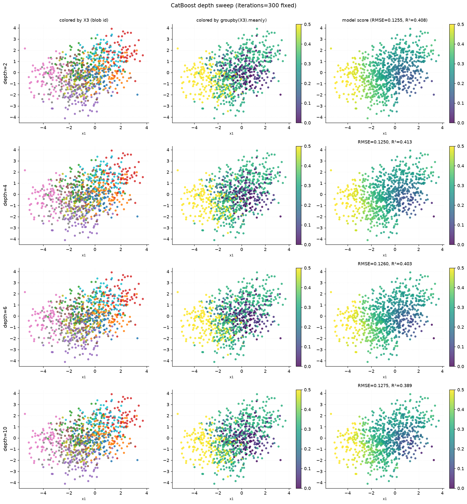
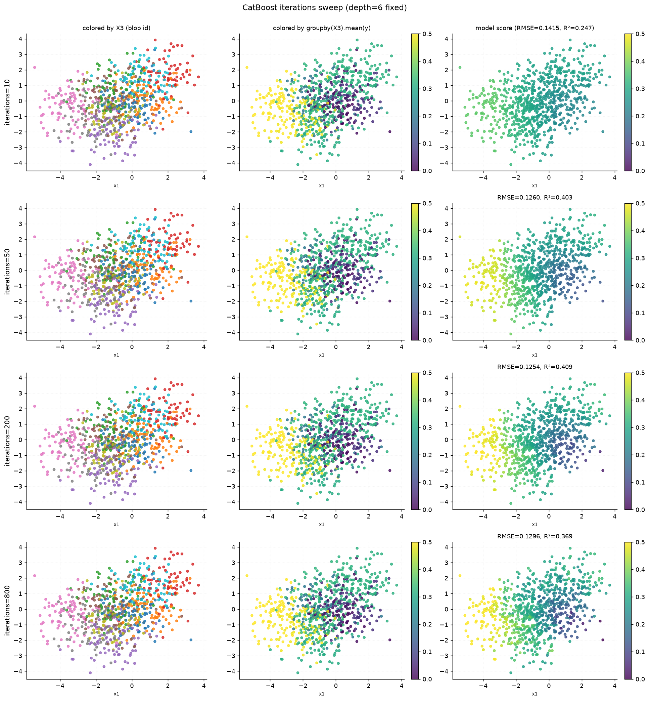

# CatBoost Hyperparameter Sweep — Overlapping Blob Regression

> Generated by `experiments/catboost_blob_hyperparams/run_experiment.py`

---

## Experimental setup

| Parameter | Value |
|-----------|-------|
| DGP | BlobRegressionDGP |
| n_blobs | 10 |
| Target range | Uniform(0.0, 0.5) per blob |
| n_train / n_plot | 4,000 / 800 |
| Model features | x1, x2 (x3 blob id withheld) |
| Model | CatBoostRegressor (RMSE loss) |
| Depth sweep | [2, 4, 6, 10] (iterations=300 fixed) |
| Iterations sweep | [10, 50, 200, 800] (depth=6 fixed) |

---

## Results

### Depth sweep

| depth | RMSE | R² |
|------:|-----:|---:|
| 2 | 0.1255 | 0.408 |
| 4 | 0.1250 | 0.413 |
| 6 | 0.1260 | 0.403 |
| 10 | 0.1275 | 0.389 |

### Iterations sweep

| iterations | RMSE | R² |
|-----------:|-----:|---:|
| 10 | 0.1415 | 0.247 |
| 50 | 0.1260 | 0.403 |
| 200 | 0.1254 | 0.409 |
| 800 | 0.1296 | 0.369 |

---

## Figures

Each row is one hyperparameter trial. Left: points colored by true blob id (X3).
Middle: points colored by the true per-blob mean target (groupby(X3).mean(y)) —
this is the ground-truth surface the model has to recover from (x1, x2) alone.
Right: points colored by the model's predicted score, on the same color scale
as the middle panel for direct visual comparison.

---

Raw data: `outputs/results.csv`
