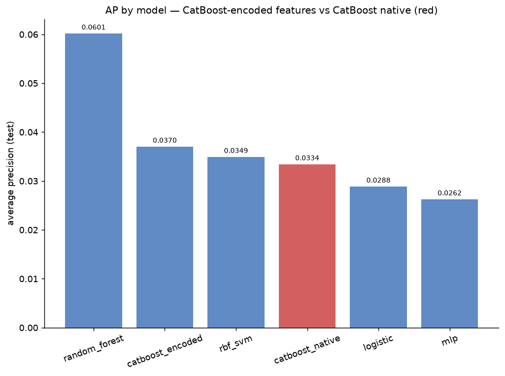
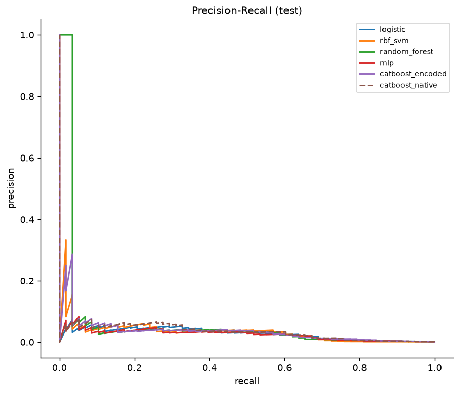

# CatBoost-Encoder Model Comparison — Report

> Generated by `experiments/catboost_encoder_models/run_experiment.py`.
> Profile: **default**.

## Flow

```
data -> catboost_encoder -> model_i training -> evaluation
```

`category_encoders.CatBoostEncoder` is an ordered, permutation-based target encoding that borrows CatBoost's internal "Ordered TS" categorical-handling trick, implemented entirely outside CatBoost as a plain sklearn transformer. Same data-generating process and undersampling discipline as `experiments/imbalanced_classification` and `experiments/encoder_comparison`: train on the 10%-positive `train_under`, evaluate on `val_full`/`test_full` at the true ~0.1% base rate.

## Setup

| Parameter | Value |
|-----------|-------|
| N_full | 300,000 |
| pi (true train base rate) | 0.00097 |
| train_under | 1,740 (pos rate 0.100) |
| Encoder | CatBoostEncoder (ordered target encoding) |
| Models | logistic, rbf_svm, random_forest, mlp, catboost_encoded (+ catboost_native) |

## Final report

```
Model leaderboard (AP, test):
  random_forest        AP=0.0601
  catboost_encoded     AP=0.0370
  rbf_svm              AP=0.0349
  catboost_native      AP=0.0334
  logistic             AP=0.0288
  mlp                  AP=0.0262

CatBoost native (AP=0.0334) loses to CatBoost fed the CatBoostEncoder features (AP=0.0370) by -0.0036.

Best overall: random_forest (AP=0.0601)
```

## Leaderboard (test split)

| model_name | average_precision | roc_auc | log_loss | train_time_seconds |
|---|---|---|---|---|
| random_forest | 0.0601 | 0.9036 | 0.0622 | 1.0277 |
| catboost_encoded | 0.0370 | 0.9173 | 0.0618 | 0.6807 |
| rbf_svm | 0.0349 | 0.8106 | 0.0765 | 0.0852 |
| catboost_native | 0.0334 | 0.9141 | 0.0570 | 0.5150 |
| logistic | 0.0288 | 0.9120 | 0.0687 | 0.0071 |
| mlp | 0.0262 | 0.9094 | 0.0755 | 0.2002 |

*`catboost_native` has no separate encode step — its categorical split search happens inside the boosting fit, so its encode timings are n/a.*

## Plots

### AP by model



*Average precision (test) per model. CatBoost-native is highlighted in red since it isn't fed the CatBoostEncoder features.*

### Precision-Recall



*PR curves (test). CatBoost-native is dashed to distinguish it from the encoded models.*

See `README.md` for how to interpret the encoder and metrics.

