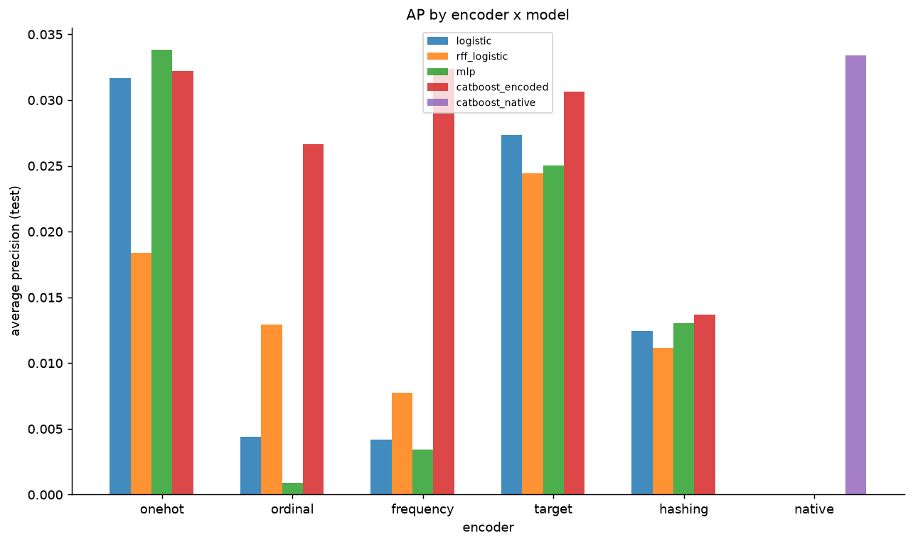
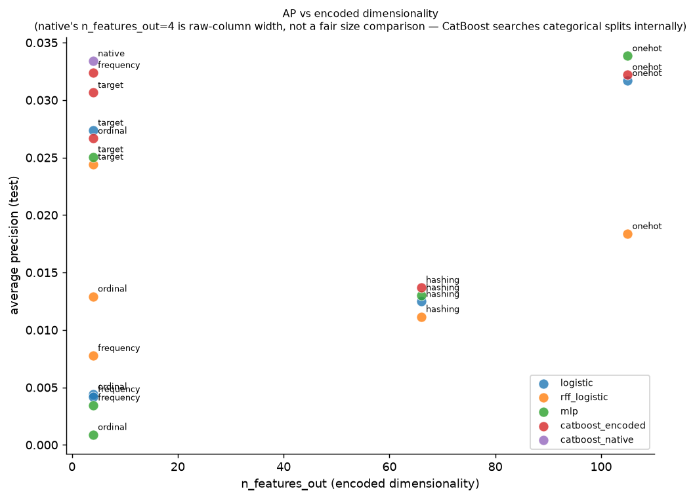
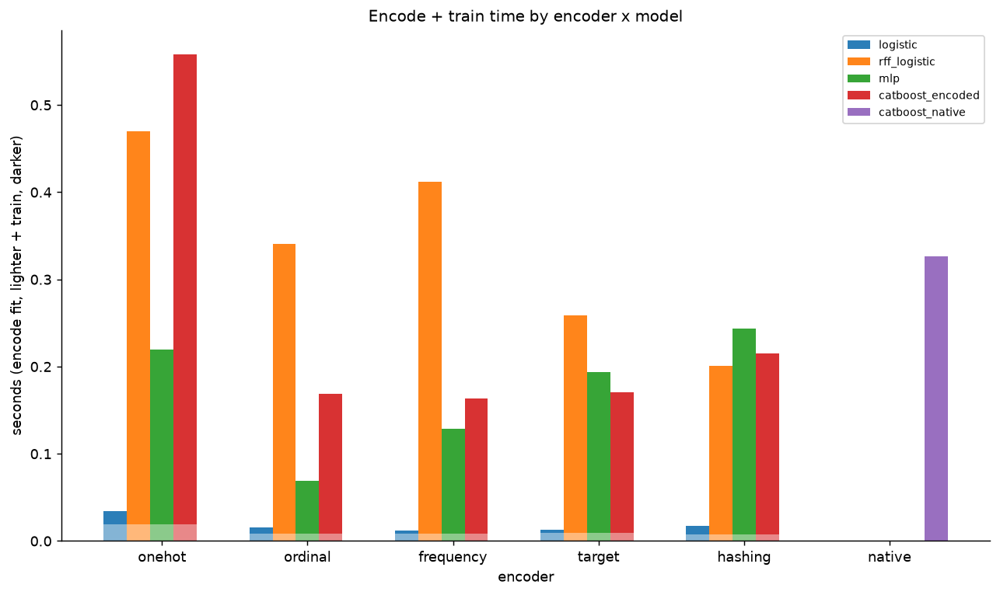

# Encoder Comparison — Report

> Generated by `experiments/encoder_comparison/run_experiment.py`.
> Profile: **default**.

## Flow

```
data -> encoder_i -> model_j training -> evaluation
```

Same data-generating process and undersampling discipline as `experiments/imbalanced_classification`: train on the 10%-positive `train_under`, evaluate on `val_full`/`test_full` at the true ~0.1% base rate.

## Setup

| Parameter | Value |
|-----------|-------|
| N_full | 300,000 |
| pi (true train base rate) | 0.00097 |
| train_under | 1,740 (pos rate 0.100) |
| Encoders | onehot, ordinal, frequency, target, hashing (+ CatBoost native) |
| Models | logistic, rff_logistic, mlp, catboost_encoded (+ catboost_native) |

## Final report

```
Best encoder per model (AP, test):
  catboost_encoded     frequency  AP=0.0324
  catboost_native      native     AP=0.0334
  logistic             onehot     AP=0.0317
  mlp                  onehot     AP=0.0338
  rff_logistic         target     AP=0.0244

CatBoost native (AP=0.0334) beats its best encoded variant (frequency, AP=0.0324) by +0.0010.

Best overall: mlp x onehot (AP=0.0338)
```

## Leaderboard (test split, all model x encoder combinations)

| model_name | encoder | average_precision | roc_auc | log_loss | n_features_out | train_time_seconds |
|---|---|---|---|---|---|---|
| mlp | onehot | 0.0338 | 0.9114 | 0.0586 | 105 | 0.2003 |
| catboost_native | native | 0.0334 | 0.9141 | 0.0570 | 4 | 0.3268 |
| catboost_encoded | frequency | 0.0324 | 0.9159 | 0.0611 | 4 | 0.1554 |
| catboost_encoded | onehot | 0.0322 | 0.9198 | 0.0619 | 105 | 0.5388 |
| logistic | onehot | 0.0317 | 0.9133 | 0.0673 | 105 | 0.0147 |
| catboost_encoded | target | 0.0307 | 0.9142 | 0.0648 | 4 | 0.1614 |
| logistic | target | 0.0274 | 0.9099 | 0.0680 | 4 | 0.0039 |
| catboost_encoded | ordinal | 0.0267 | 0.9070 | 0.0742 | 4 | 0.1602 |
| mlp | target | 0.0251 | 0.9066 | 0.0694 | 4 | 0.1848 |
| rff_logistic | target | 0.0244 | 0.9004 | 0.0712 | 4 | 0.2493 |
| rff_logistic | onehot | 0.0184 | 0.8757 | 0.0809 | 105 | 0.4505 |
| catboost_encoded | hashing | 0.0137 | 0.8893 | 0.0763 | 66 | 0.2072 |
| mlp | hashing | 0.0130 | 0.8869 | 0.0788 | 66 | 0.2359 |
| rff_logistic | ordinal | 0.0129 | 0.7870 | 0.0832 | 4 | 0.3319 |
| logistic | hashing | 0.0125 | 0.8856 | 0.0814 | 66 | 0.0091 |
| rff_logistic | hashing | 0.0112 | 0.8658 | 0.0840 | 66 | 0.1931 |
| rff_logistic | frequency | 0.0078 | 0.8132 | 0.0954 | 4 | 0.4037 |
| logistic | ordinal | 0.0044 | 0.8338 | 0.0980 | 4 | 0.0070 |
| logistic | frequency | 0.0042 | 0.8316 | 0.0976 | 4 | 0.0041 |
| mlp | frequency | 0.0035 | 0.8106 | 0.1079 | 4 | 0.1205 |
| mlp | ordinal | 0.0009 | 0.4813 | 0.1837 | 4 | 0.0598 |

## Encoder diagnostics

Dimensionality and timing are properties of the encoder alone, independent of which model consumes its output.

| encoder | n_features_out | fit_time_seconds | val_transform_time_seconds | test_transform_time_seconds |
|---|---|---|---|---|
| onehot | 105 | 0.0195 | 0.3927 | 0.2924 |
| ordinal | 4 | 0.0088 | 0.0154 | 0.0168 |
| frequency | 4 | 0.0082 | 0.0059 | 0.0058 |
| target | 4 | 0.0093 | 0.0144 | 0.0143 |
| hashing | 66 | 0.0080 | 0.0831 | 0.1098 |
| native | 4 | n/a | n/a | n/a |

*`native` has no separate encode step — CatBoost's categorical split search happens inside the boosting fit, so its encode timings are n/a and its `n_features_out=4` is the raw column count, not a comparable dimensionality.*

## Plots

### AP by encoder x model



*Grouped bars: average precision (test) for every model x encoder combination. `catboost_native` appears only at the `native` x-position.*

### AP vs encoded dimensionality



*Does a bigger encoded representation (OneHot) win over compact ones (Target, Hashing)? `native`'s x=4 is not a fair size comparison — see caveat above.*

### Encode + train time



*Stacked bars: encode fit time (lighter) + model train time (darker), per model x encoder. Is a fancier encoder worth its extra cost?*

See `README.md` for how to interpret each encoder and metric.

