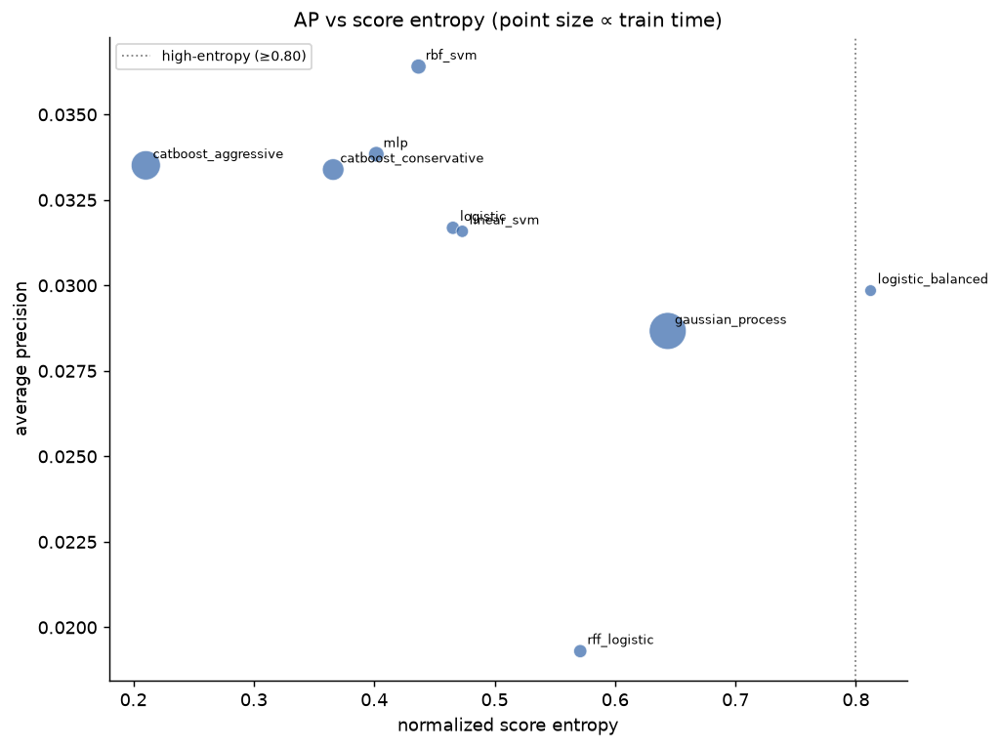
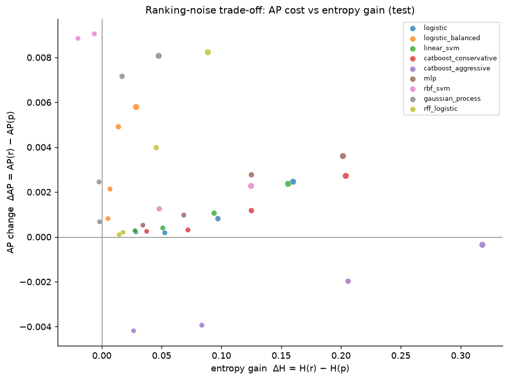
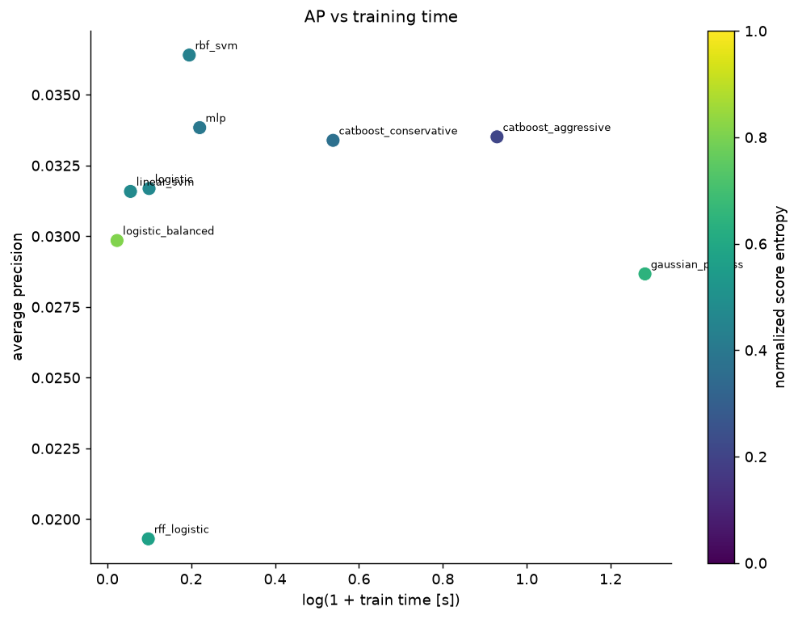
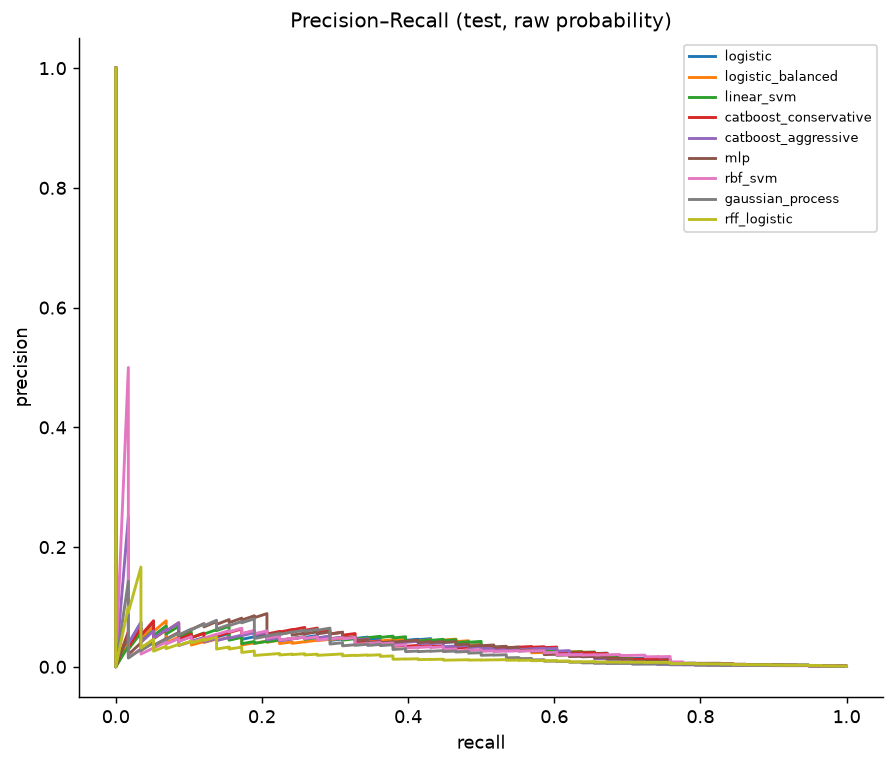
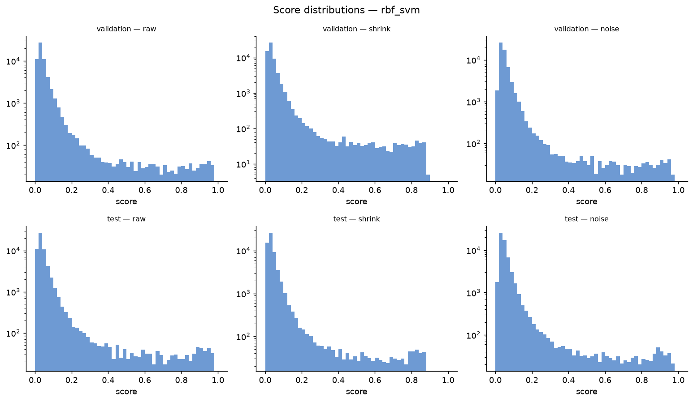
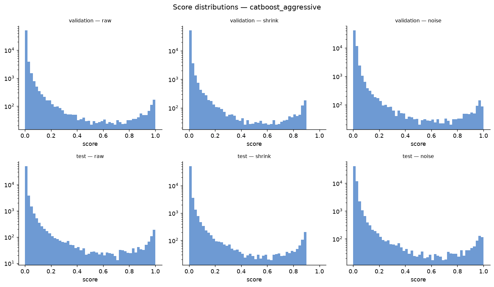
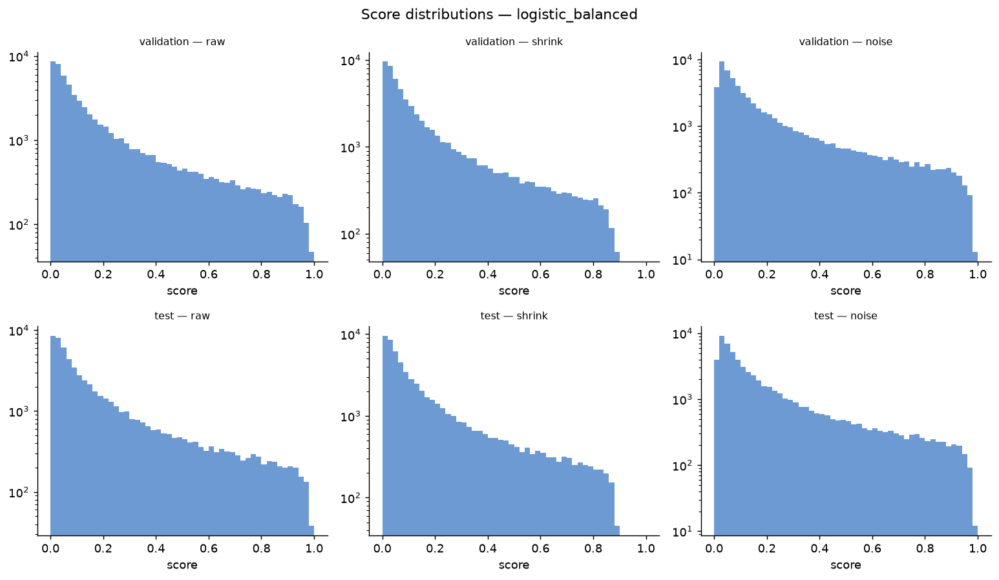
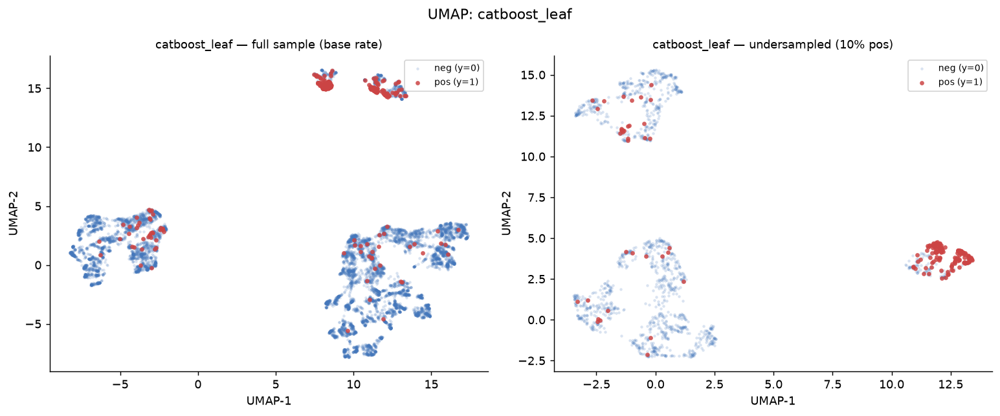

# Imbalanced Binary Classification — Report

> Generated by `experiments/imbalanced_classification/run_experiment.py`.
> Profile: **default**.

## Setup

| Parameter | Value |
|-----------|-------|
| N_full | 300,000 |
| Full positive rate | 0.00097 (290 positives) |
| pi (true train base rate) | 0.00097 |
| train_full / val_full / test_full | 180,000 / 60,000 / 60,000 |
| train_under | 1,740 (pos rate 0.100) |

Models train on the 10%-positive **undersample**; evaluation is on **val_full / test_full**, which preserve the real ~0.1% base rate (the deployment distribution).

## Final report

```
Best model by AP:                    rbf_svm (AP=0.0364)
Best model by normalized entropy:    logistic_balanced (H=0.812)
Best AP among high-entropy models:   logistic_balanced (AP=0.0298, H=0.812)
Fastest good model (AP≥0.95·best):   rbf_svm (0.22s, AP=0.0364)
Best AP-loss / entropy-gain trade:   catboost_aggressive @α=0.9 (ΔH=+0.318, ΔAP=-0.0004)
Best candidate for production:       logistic_balanced (AP=0.0298, H=0.812, tie=0.000)
```

## Model leaderboard (prior=none, raw score, test split)

| model_name | average_precision | roc_auc | normalized_score_entropy | tie_rate | train_time_seconds |
|---|---|---|---|---|---|
| rbf_svm | 0.0364 | 0.8954 | 0.4368 | 0.0000 | 0.2159 |
| mlp | 0.0338 | 0.9114 | 0.4017 | 0.0000 | 0.2465 |
| catboost_aggressive | 0.0335 | 0.8877 | 0.2103 | 0.0166 | 1.5322 |
| catboost_conservative | 0.0334 | 0.9141 | 0.3659 | 0.1190 | 0.7131 |
| logistic | 0.0317 | 0.9133 | 0.4654 | 0.0000 | 0.1047 |
| linear_svm | 0.0316 | 0.9057 | 0.4731 | 0.0000 | 0.0569 |
| logistic_balanced | 0.0298 | 0.9025 | 0.8122 | 0.0000 | 0.0235 |
| gaussian_process | 0.0287 | 0.8782 | 0.6437 | 0.0000 | 2.6033 |
| rff_logistic | 0.0193 | 0.9024 | 0.5711 | 0.0000 | 0.1028 |

## Metrics relative to Gaussian process (ratio tables)

Every cell is `model_metric / gaussian_process_metric` for that split (prior=none, raw score). The Gaussian process row is always 1.000. Ratios >1 beat the GP on *higher-is-better* metrics (AP, AUC, entropy) and *lose* to it on *lower-is-better* ones (log_loss, brier_score, train_time); read each column against its own direction. NaN means the GP's value was 0 (e.g. its `tie_rate`), so the ratio is undefined.

### test

| model_name | average_precision | roc_auc | log_loss | brier_score | normalized_score_entropy | tie_rate | train_time_seconds |
|---|---|---|---|---|---|---|---|
| rbf_svm | 1.270× | 1.020× | 0.516× | 0.491× | 0.679× | n/a | 0.083× |
| mlp | 1.180× | 1.038× | 0.451× | 0.549× | 0.624× | n/a | 0.095× |
| catboost_aggressive | 1.169× | 1.011× | 0.439× | 0.597× | 0.327× | n/a | 0.589× |
| catboost_conservative | 1.165× | 1.041× | 0.439× | 0.530× | 0.568× | n/a | 0.274× |
| logistic | 1.105× | 1.040× | 0.519× | 0.606× | 0.723× | n/a | 0.040× |
| linear_svm | 1.102× | 1.031× | 0.526× | 0.608× | 0.735× | n/a | 0.022× |
| logistic_balanced | 1.041× | 1.028× | 2.182× | 3.699× | 1.262× | n/a | 0.009× |
| gaussian_process | 1.000× | 1.000× | 1.000× | 1.000× | 1.000× | n/a | 1.000× |
| rff_logistic | 0.673× | 1.028× | 0.635× | 0.609× | 0.887× | n/a | 0.039× |

### val

| model_name | average_precision | roc_auc | log_loss | brier_score | normalized_score_entropy | tie_rate | train_time_seconds |
|---|---|---|---|---|---|---|---|
| gaussian_process | 1.000× | 1.000× | 1.000× | 1.000× | 1.000× | n/a | 1.000× |
| rff_logistic | 0.980× | 1.014× | 0.637× | 0.611× | 0.888× | n/a | 0.039× |
| logistic | 0.843× | 1.036× | 0.516× | 0.597× | 0.723× | n/a | 0.040× |
| logistic_balanced | 0.828× | 1.019× | 2.180× | 3.714× | 1.259× | n/a | 0.009× |
| linear_svm | 0.821× | 1.023× | 0.525× | 0.606× | 0.734× | n/a | 0.022× |
| rbf_svm | 0.800× | 1.019× | 0.514× | 0.490× | 0.679× | n/a | 0.083× |
| catboost_conservative | 0.763× | 1.039× | 0.436× | 0.527× | 0.568× | n/a | 0.274× |
| mlp | 0.701× | 1.032× | 0.452× | 0.549× | 0.625× | n/a | 0.095× |
| catboost_aggressive | 0.521× | 1.003× | 0.444× | 0.622× | 0.334× | n/a | 0.589× |

## Plots

### AP vs score entropy — the core trade-off



*x = normalized score entropy, y = average precision, point size ∝ train time. Top-right (accurate *and* smooth) is ideal; the dotted line marks the high-entropy threshold (H ≥ 0.80). Tree models sit left (spiky scores), linear / balanced models sit right.*

### Ranking-noise trade-off — headline plot



*For the deterministic noise score r = αp + (1-α)u: x = entropy gain ΔH = H(r) − H(p), y = AP change ΔAP = AP(r) − AP(p). Points near the top-right buy large smoothness gains for negligible ranking loss; steep drops mean the noise is destroying signal.*

### AP vs training time



*x = log(1 + train time [s]), y = AP, colour = normalized entropy — find the cheapest model at a given accuracy.*

### Bucket lift by score decile


*Positive rate per score decile (log y) with the true base-rate line. A good ranker's top decile sits far above the base rate.*

### Precision–recall curves



*PR curves (test, raw probability) — the right diagnostic under heavy imbalance, where ROC-AUC looks deceptively high.*

### Score distributions (per model)

Raw probability vs post-hoc shrinkage vs deterministic-noise ranking score, validation and test, on a log y-axis so the rare high-score tail is visible.

<details><summary>Show per-model score histograms</summary>



*`rbf_svm` — raw vs shrinkage vs noise score.*


*`mlp` — raw vs shrinkage vs noise score.*



*`catboost_aggressive` — raw vs shrinkage vs noise score.*


*`catboost_conservative` — raw vs shrinkage vs noise score.*


*`logistic` — raw vs shrinkage vs noise score.*


*`linear_svm` — raw vs shrinkage vs noise score.*



*`logistic_balanced` — raw vs shrinkage vs noise score.*


*`gaussian_process` — raw vs shrinkage vs noise score.*


*`rff_logistic` — raw vs shrinkage vs noise score.*

</details>

### UMAP representations (full sample vs undersampled)

Each figure pairs the full-population view (positives are a sparse minority) with the 10%-positive undersample the model trains on.


*Raw one-hot + scaled features (euclidean). The model-agnostic view of class separability before any model — full sample (true base rate) vs undersample.*



*CatBoost leaf-index one-hot (cosine) — the *supervised* tree view. The rare positive class forms much tighter, more separated structure than in raw space.*


*Random-Fourier feature space (euclidean) that the RFF+logistic model actually sees.*

See `README.md` for how to interpret each metric and plot.

