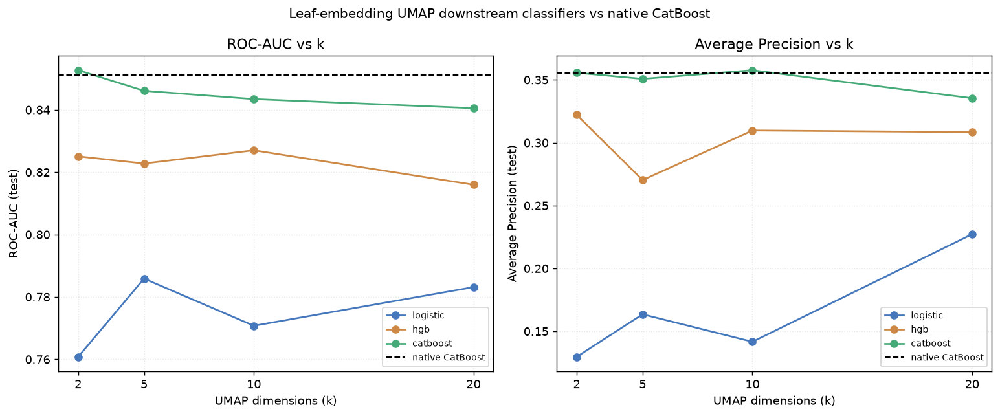
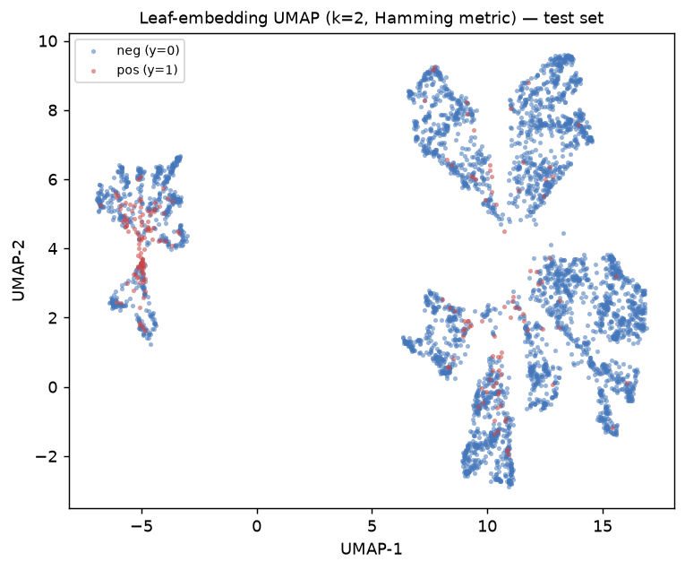

# Leaf-Embedding UMAP Reduction vs Native CatBoost

> Generated by `experiments/leaf_embedding_umap/run_experiment.py`

---

## Experimental setup

| Parameter | Value |
|-----------|-------|
| DGP | GaussianBinaryDGP + ShiftedDGP (fixed-edge binning) |
| p_pos | 0.05 |
| Numeric features | num_x1 (info=1.2), num_x2 (info=0.6), num_x3 (info=0.2) |
| Categorical features | cat_x1 (info=1.0), cat_x2 (info=0.5), cat_x3 (info=0.1) |
| n_train / n_test | 4,000 / 4,000 |
| Leaf-extractor CatBoost | iterations=300, depth=6, lr=0.05 |
| Trees / leaf-embedding dimensionality | 300 |
| Leaf embedding | raw per-tree leaf indices (no one-hot) |
| UMAP metric | Hamming |
| k values | 2, 5, 10, 20 |
| Downstream classifiers | logistic, hgb, catboost |

---

## Native CatBoost baseline (trained on raw features)

| Metric | Value |
|--------|------:|
| ROC-AUC | 0.8512 |
| Average Precision | 0.3555 |

---

## UMAP + downstream classifier results

| k | classifier | ROC-AUC | Average Precision |
|--:|------------|--------:|-------------------:|
| 2 | catboost | 0.8527 | 0.3556 |
| 2 | hgb | 0.8251 | 0.3222 |
| 2 | logistic | 0.7608 | 0.1297 |
| 5 | catboost | 0.8461 | 0.3508 |
| 5 | hgb | 0.8228 | 0.2703 |
| 5 | logistic | 0.7859 | 0.1635 |
| 10 | catboost | 0.8434 | 0.3576 |
| 10 | hgb | 0.8270 | 0.3097 |
| 10 | logistic | 0.7708 | 0.1417 |
| 20 | catboost | 0.8405 | 0.3354 |
| 20 | hgb | 0.8160 | 0.3084 |
| 20 | logistic | 0.7831 | 0.2272 |

---

## Figures

### Metric vs k

ROC-AUC and Average Precision for each downstream classifier across k, with the
native CatBoost baseline shown as a dashed reference line.

### UMAP scatter (k=2)

2D leaf-embedding UMAP projection of the test set, colored by label. Negatives
drawn first so the minority positive class is visible on top.

---

## Key takeaways

1. **A CatBoost model trained on just a 10-D UMAP projection of the leaf embedding (catboost) nearly matches the native baseline** (AP 0.3576 vs 0.3555, AUC 0.8434 vs 0.8512) — most of the information CatBoost's trees encode about the categorical+numerical feature mix survives a drastic compression from 300 raw leaf indices down to 10 continuous dimensions.

2. **Classifier choice on top of the UMAP embedding matters more than k.** CatBoost consistently beats HGB, which consistently beats logistic regression, at every k — the UMAP-reduced space is not linearly separable, so a linear downstream model leaves substantial performance on the table regardless of dimensionality.

3. **Diminishing/non-monotonic returns to higher k.** Performance does not improve monotonically with k for any downstream classifier — a 2-D Hamming-metric UMAP embedding already captures most of the leaf-membership signal relevant to the label, and additional dimensions mostly add noise for the downstream fit rather than new signal.

---

Raw data: `outputs/results.csv`
