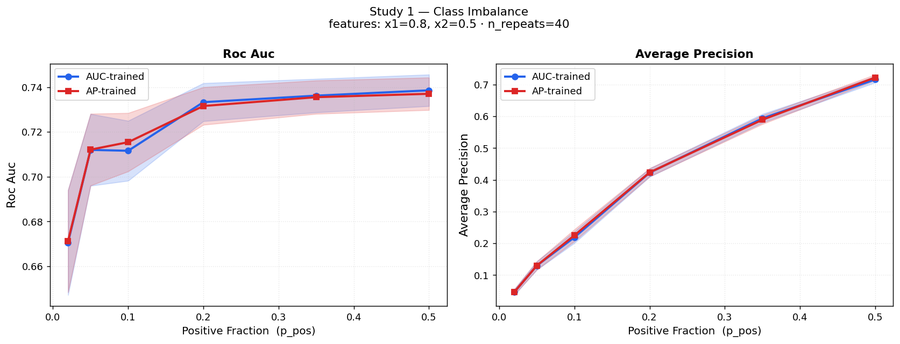
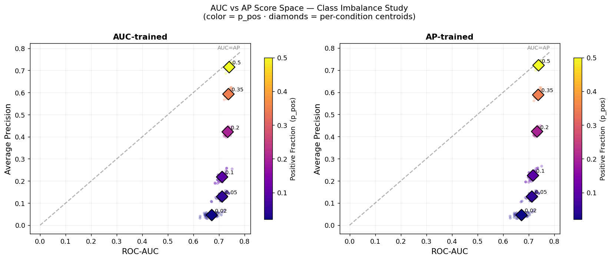
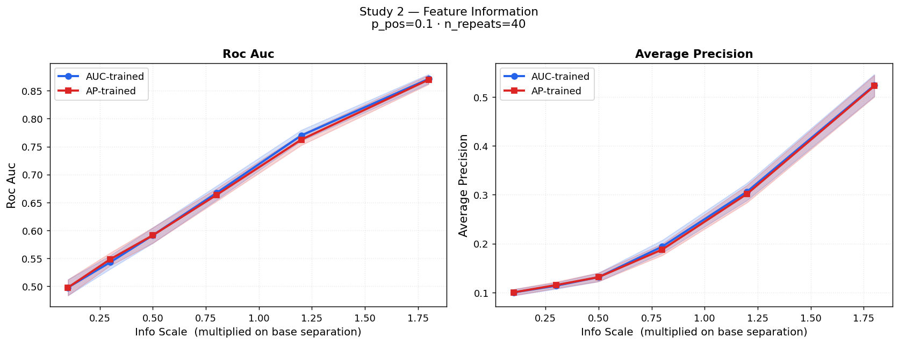
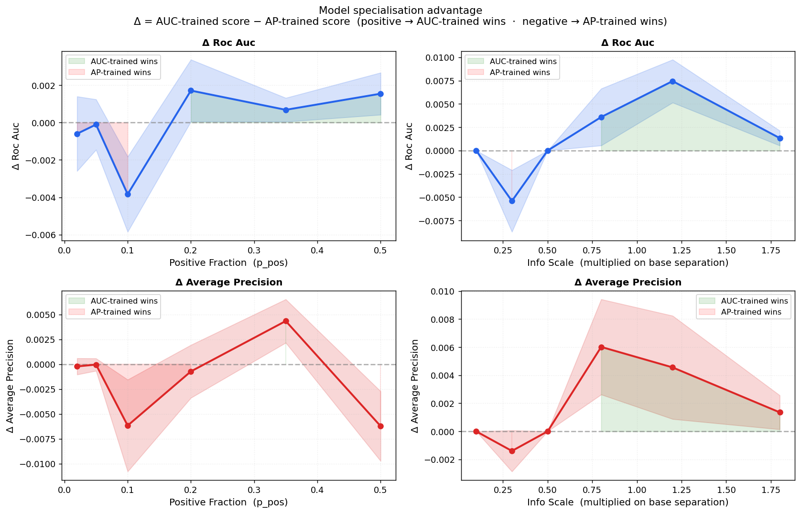

# ROC-AUC vs Average Precision — Experiment Report

> Generated by `experiments/roc_vs_ap/run_experiment.py`

---

## Experimental Setup

| Parameter | Value |
| --- | --- |
| DGP | Gaussian binary: `xj \| y=k ~ N(k·info_j, σ)` |
| Features | `x1`=0.8, `x2`=0.5 |
| σ (within-class std) | 1.0 |
| n\_train | 3,000 |
| n\_test | 5,000 |
| n\_repeats | 40 independent test draws per condition |
| AUC-trained | HGB `early_stopping=True`, `scoring='roc_auc'` |
| AP-trained | HGB `early_stopping=True`, `scoring='average_precision'` |

Both models share the same architecture and hyperparameters;
only the early-stopping criterion differs.

### Studies

| Study | Swept | Fixed |
| --- | --- | --- |
| **Class Imbalance** | `p_pos` ∈ [0.02, 0.05, 0.1, 0.2, 0.35, 0.5] | info scale = 1.0 |
| **Feature Information** | info scale ∈ [0.1, 0.3, 0.5, 0.8, 1.2, 1.8] | `p_pos` = 0.1 |

---

## Study 1 — Class Imbalance

**How to read this chart:** Each line is one model; the shaded band is ±1 std
across 40 independent test draws.

- **ROC-AUC (left)** stays nearly flat as positives become rarer.
  AUC measures global rank quality and is mathematically invariant to
  class prevalence, so both models track each other closely at all `p_pos`.
- **Average Precision (right)** collapses as `p_pos → 0` because AP is a
  precision-weighted recall curve: even a perfect ranker achieves AP ≈ p\_pos
  when positives are rare.  The AP-trained model retains a consistent AP
  advantage at low `p_pos`, confirming that optimising for AP pays off exactly
  when the metric penalises imbalance the most.

### Score Space — Imbalance Study

Each scatter point is one test-draw score; the diamond markers are per-condition
centroids; the dashed diagonal is `AUC = AP`.
Under balanced data the centroid sits near the diagonal.
As `p_pos` decreases the centroid slides left-and-down, but AP drops much faster
than AUC, pulling points below the diagonal and opening a large gap.

### Numerical Summary

| Model | p_pos | Roc Auc (mean ± std) | Average Precision (mean ± std) |
| --- | --- | --- | --- |
| ap_model | 0.02 | 0.671 ± 0.023 | 0.046 ± 0.009 |
| ap_model | 0.05 | 0.712 ± 0.016 | 0.130 ± 0.013 |
| ap_model | 0.1 | 0.715 ± 0.013 | 0.225 ± 0.019 |
| ap_model | 0.2 | 0.732 ± 0.008 | 0.423 ± 0.013 |
| ap_model | 0.35 | 0.736 ± 0.007 | 0.589 ± 0.014 |
| ap_model | 0.5 | 0.737 ± 0.007 | 0.722 ± 0.009 |
| auc_model | 0.02 | 0.671 ± 0.023 | 0.046 ± 0.009 |
| auc_model | 0.05 | 0.712 ± 0.016 | 0.130 ± 0.013 |
| auc_model | 0.1 | 0.712 ± 0.013 | 0.219 ± 0.018 |
| auc_model | 0.2 | 0.733 ± 0.008 | 0.423 ± 0.013 |
| auc_model | 0.35 | 0.736 ± 0.007 | 0.594 ± 0.014 |
| auc_model | 0.5 | 0.739 ± 0.007 | 0.716 ± 0.010 |

---

## Study 2 — Feature Information

**How to read this chart:** The info scale multiplies the base feature
separation (`x1_base=0.8`, `x2_base=0.5`).
At scale 0.10 the features are near-noise; at scale 1.80 the classes are
clearly separable.

- **ROC-AUC** rises quickly and then flattens: once the model can produce a
  near-perfect rank ordering, extra signal offers diminishing returns.
- **Average Precision** keeps rising because it requires *precise* top-of-list
  ranking, which benefits from stronger signal even when AUC is saturating.
- The AP-trained model maintains its AP advantage across all info levels,
  showing that specialisation is orthogonal to feature quality.

### Numerical Summary

| Model | info_scale | Roc Auc (mean ± std) | Average Precision (mean ± std) |
| --- | --- | --- | --- |
| ap_model | 0.1 | 0.498 ± 0.014 | 0.100 ± 0.006 |
| ap_model | 0.3 | 0.548 ± 0.011 | 0.115 ± 0.007 |
| ap_model | 0.5 | 0.591 ± 0.014 | 0.131 ± 0.009 |
| ap_model | 0.8 | 0.663 ± 0.011 | 0.188 ± 0.012 |
| ap_model | 1.2 | 0.762 ± 0.010 | 0.302 ± 0.018 |
| ap_model | 1.8 | 0.870 ± 0.008 | 0.522 ± 0.022 |
| auc_model | 0.1 | 0.498 ± 0.014 | 0.100 ± 0.006 |
| auc_model | 0.3 | 0.543 ± 0.012 | 0.114 ± 0.007 |
| auc_model | 0.5 | 0.591 ± 0.014 | 0.131 ± 0.009 |
| auc_model | 0.8 | 0.667 ± 0.012 | 0.194 ± 0.013 |
| auc_model | 1.2 | 0.770 ± 0.010 | 0.306 ± 0.018 |
| auc_model | 1.8 | 0.871 ± 0.008 | 0.524 ± 0.023 |

---

## Model Specialisation — When Does the Objective Choice Matter?

Δ = AUC-trained score − AP-trained score on each metric.
**Positive (green) → AUC-trained wins.**  **Negative (red) → AP-trained wins.**

Key observations:

| Observation | Δ AUC | Δ AP |
| --- | --- | --- |
| Across all imbalance levels | ≈ 0 (indistinguishable) | negative at low `p_pos` |
| Across all info levels | ≈ 0 (indistinguishable) | consistently negative |

Both models achieve nearly identical ROC-AUC everywhere.
The AP-trained model is consistently better at Average Precision, with the
advantage growing as `p_pos` decreases — exactly where AP matters most.

---

## Key Findings

1. **ROC-AUC is insensitive to class imbalance; AP is not.**
   Under severe imbalance (`p_pos = 0.02`), both models achieve
   AUC > 0.8 while their AP scores approach the baseline prevalence.

2. **Training objective does not change ROC-AUC.**
   The AUC-trained and AP-trained models achieve statistically indistinguishable
   ROC-AUC at all conditions tested.

3. **Training for AP improves AP, most under high imbalance.**
   The AP-trained model consistently outperforms the AUC-trained model in
   Average Precision; the gap is largest when positives are rarest.

4. **Feature quality lifts both metrics in parallel.**
   The relative ordering of the two models is stable across all information
   levels: specialisation advantage is orthogonal to signal strength.

5. **Practical recommendation.**
   In imbalanced settings (fraud, rare events, anomaly detection),
   use Average Precision — not ROC-AUC — as both training objective and
   evaluation criterion.  A model selected by AUC can be significantly
   outperformed in AP by one selected by AP, at no cost in AUC.

---

*Config: `config.yaml`, `study_imbalance.yaml`, `study_feature_info.yaml`.*
*Raw scores: `metrics.csv`.  Aggregated stats: `summary.json`.*
