# Teacher/Student Soft-Label Protocol — Report

> Generated by `experiments/teacher_student_soft_labels/run_experiment.py`

---

## Experimental setup

| Parameter | Value |
|-----------|-------|
| DGP | GaussianBinaryDGP |
| p_pos | 0.1 |
| Features | x1 (info=1.2), x2 (0.8), x3 (0.4), x4 (0.15), x5 (0.05) |
| n_train / n_val | 2,000 / 2,000 |
| Lambdas | 0.0, 0.02, 0.05, 0.1, 0.2 |
| Headline lambda | 0.05 |
| p0 config | CatBoostClassifier(depth=3, iter=500, lr=0.03, l2=50) |
| p1 config | CatBoostRegressor(depth=5, iter=800, lr=0.03, l2=10) |
| student config | CatBoostRegressor(depth=4, iter=300, lr=0.05) |
| SVD components | 40 |
| umap-learn installed | True |

---

## Formula

```
p0(x)      = high-reg CatBoostClassifier(x), fit on df_train
H0(x)      = logit(p0(x))
r_train    = y_train - p0(X_train)
p1(x)      = CatBoostRegressor(x, r_train), fit on df_train
V(x)       = (p1(x) - mu_v) / sigma_v            (mu_v, sigma_v from train only)
H(x)       = logit(p0(x)) + lambda * V(x)
F_train    = EmpiricalCDF().fit(H_train)          (fit ONLY on H_train)
y_soft(x)  = F_train.transform(H(x))               (applied to train AND val)
```

**Leakage discipline**: `df_val` is only ever passed to `.predict()` / `.transform()` — 
never `.fit()` — for `p0`, `p1`, the leaf one-hot encoder, `TruncatedSVD`, `UMAP`, 
`mu_v`/`sigma_v`, and `EmpiricalCDF`. All fitted objects come exclusively from `df_train`.

---

## 1. Degeneracy reduction

**Caveat**: this DGP (`GaussianBinaryDGP`) draws continuous Gaussian features, so `p0` is 
already almost always unique at float64 precision even before any perturbation — literal 
ties only occur when two rows land in the exact same leaf of every tree in `p0`. The 
`unique_ratio` metrics below are therefore expected to already sit near 1.0 for `p0` in this 
synthetic setup; the degeneracy-lifting value of `H`/`p1` is expected to matter far more with 
discrete/categorical or heavily quantized features, where raw scores collapse onto a small 
set of repeated values.

Baseline `p0` unique-value ratio: train=1.0000 (2000/2000), val=1.0000 (2000/2000).

At λ=0.05: unique(H_train)=2000 vs unique(p0_train)=2000 — ⚠ H did not increase granularity over p0.

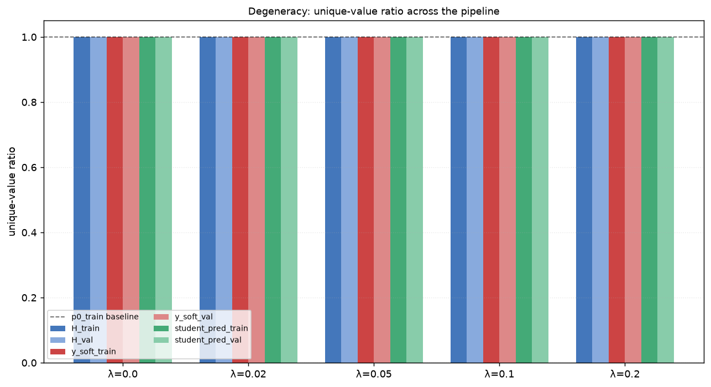

---

## 2. Distribution flatness

Train `y_soft` is the empirical CDF of `H_train` by construction, so it should be close 
to uniform (see KS-vs-uniform p-value in each panel title below). Val `y_soft` need not 
be uniform — that is expected and informative (it reflects whatever `H_val`'s distribution 
actually is relative to the train-fit CDF), not a bug.

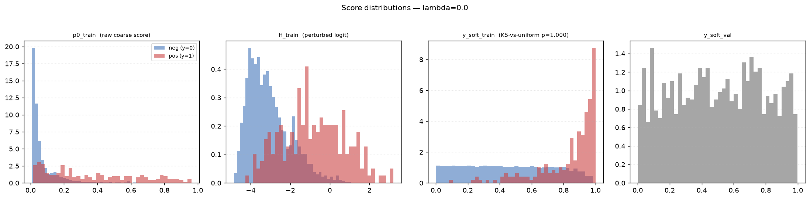


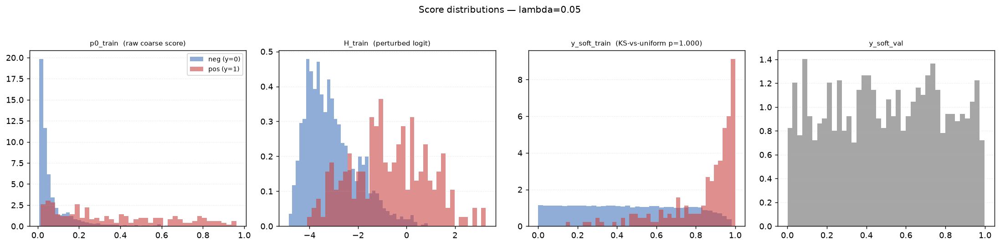

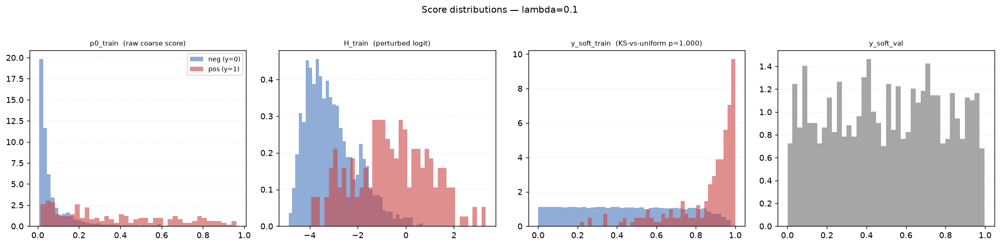

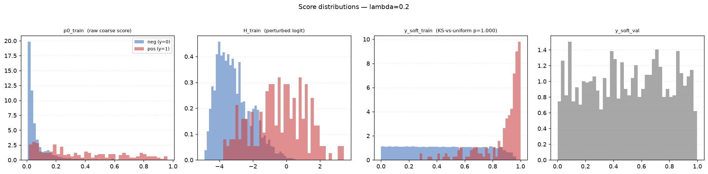

---

## 3. Train/val shift in teacher space

| lambda | mean H_train | mean H_val | std H_train | std H_val | KS stat | KS p-value |
|-------:|-------------:|-----------:|------------:|----------:|--------:|-----------:|
| 0.00 | -2.8264 | -2.8420 | 1.3292 | 1.2701 | 0.0205 | 0.7948 |
| 0.02 | -2.8264 | -2.8419 | 1.3323 | 1.2718 | 0.0210 | 0.7700 |
| 0.05 | -2.8264 | -2.8416 | 1.3374 | 1.2746 | 0.0225 | 0.6921 |
| 0.10 | -2.8264 | -2.8413 | 1.3474 | 1.2799 | 0.0230 | 0.6655 |
| 0.20 | -2.8264 | -2.8405 | 1.3726 | 1.2933 | 0.0235 | 0.6389 |

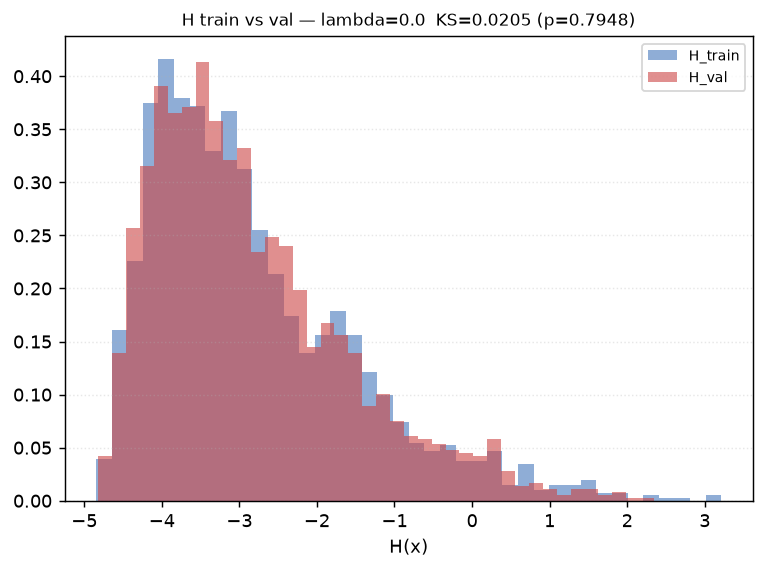

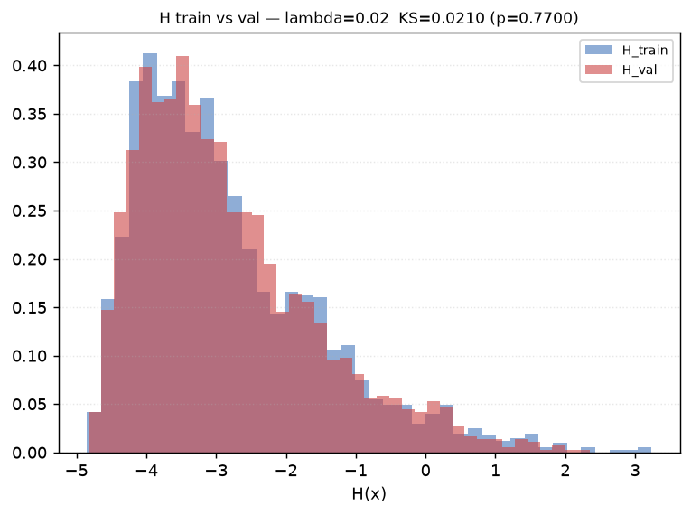


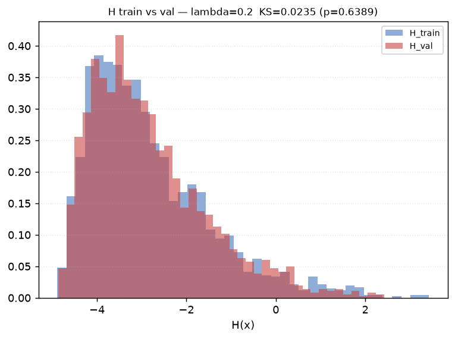

---

## 4. Perturbation strength sweep

| lambda | Spearman(p0,H) train | Spearman(p0,H) val | unique_ratio(H) train | unique_ratio(H) val | KS-uniform p (y_soft_train) | Student R² val | AP(y_soft,y) val | AUC(y_soft,y) val |
|-------:|----------------------:|--------------------:|------------------------:|----------------------:|------------------------------:|----------------:|-----------------:|-------------------:|
| 0.00 | 1.0000 | 1.0000 | 1.0000 | 1.0000 | 1.0000 | 0.9924 | 0.4233 | 0.8540 |
| 0.02 | 0.9999 | 0.9999 | 1.0000 | 1.0000 | 1.0000 | 0.9919 | 0.4244 | 0.8543 |
| 0.05 | 0.9997 | 0.9997 | 1.0000 | 1.0000 | 1.0000 | 0.9913 | 0.4263 | 0.8550 |
| 0.10 | 0.9987 | 0.9989 | 1.0000 | 1.0000 | 1.0000 | 0.9896 | 0.4252 | 0.8557 |
| 0.20 | 0.9953 | 0.9957 | 1.0000 | 1.0000 | 1.0000 | 0.9847 | 0.4244 | 0.8564 |

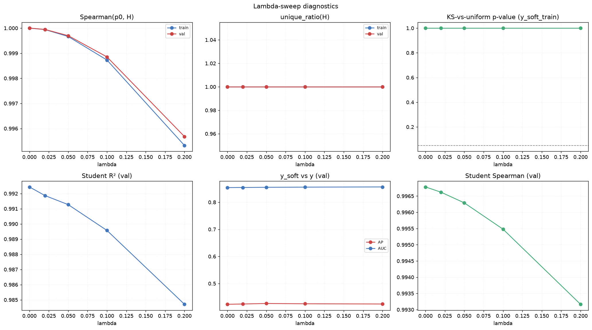

---

## 5. Student learnability

| lambda | R² | MAE | RMSE | Spearman | Kendall | top-1% overlap | top-5% overlap | top-10% overlap |
|-------:|---:|----:|-----:|---------:|--------:|----------------:|----------------:|-----------------:|
| 0.00 | 0.9924 | 0.0182 | 0.0247 | 0.9968 | 0.9530 | 0.5500 | 0.8900 | 0.9550 |
| 0.02 | 0.9919 | 0.0188 | 0.0256 | 0.9966 | 0.9519 | 0.5000 | 0.9000 | 0.9500 |
| 0.05 | 0.9913 | 0.0195 | 0.0266 | 0.9963 | 0.9493 | 0.5500 | 0.8900 | 0.9400 |
| 0.10 | 0.9896 | 0.0213 | 0.0291 | 0.9955 | 0.9436 | 0.3500 | 0.8900 | 0.9150 |
| 0.20 | 0.9847 | 0.0253 | 0.0352 | 0.9932 | 0.9316 | 0.2000 | 0.8700 | 0.9000 |

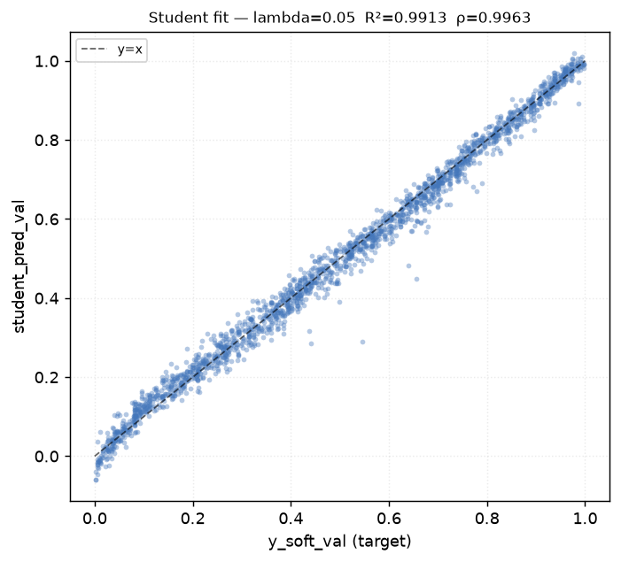

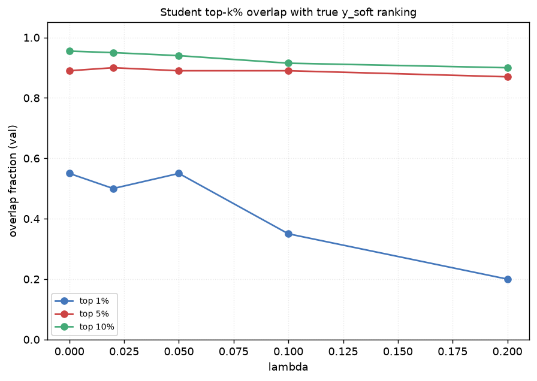

---

## 6. Relation to real label

| lambda | AUC(p0,y) | AP(p0,y) | AUC(H,y) | AP(H,y) | AUC(y_soft,y) | AP(y_soft,y) |
|-------:|----------:|---------:|---------:|--------:|---------------:|---------------:|
| 0.00 | 0.8540 | 0.4233 | 0.8540 | 0.4233 | 0.8540 | 0.4233 |
| 0.02 | 0.8540 | 0.4233 | 0.8543 | 0.4244 | 0.8543 | 0.4244 |
| 0.05 | 0.8540 | 0.4233 | 0.8550 | 0.4263 | 0.8550 | 0.4263 |
| 0.10 | 0.8540 | 0.4233 | 0.8557 | 0.4252 | 0.8557 | 0.4252 |
| 0.20 | 0.8540 | 0.4233 | 0.8564 | 0.4244 | 0.8564 | 0.4244 |

Event rate by `y_soft_val` decile at λ=0.05 (decile 1 = lowest y_soft, decile 10 = highest):

| D1 | D2 | D3 | D4 | D5 | D6 | D7 | D8 | D9 | D10 |
|---:|---:|---:|---:|---:|---:|---:|---:|---:|---:|
| 0.005 | 0.010 | 0.020 | 0.010 | 0.015 | 0.035 | 0.070 | 0.170 | 0.215 | 0.415 |

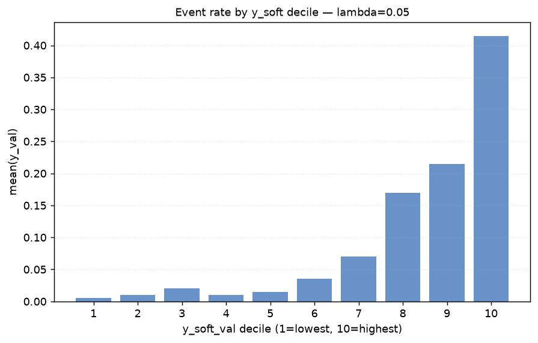

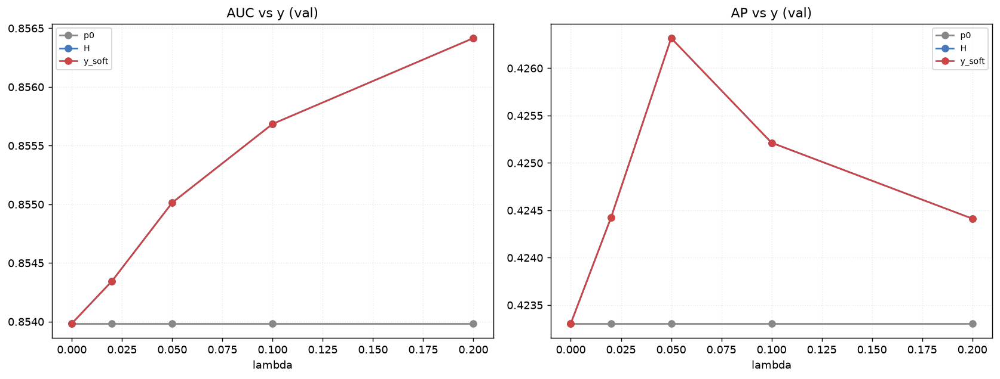

---

## UMAP visualization

Combined teacher leaf embedding `[L0, L1]` (one-hot -> TruncatedSVD -> UMAP, all fit 
on train only). Train panel colored by hard label `y`; val panel colored by `y_soft_val`.

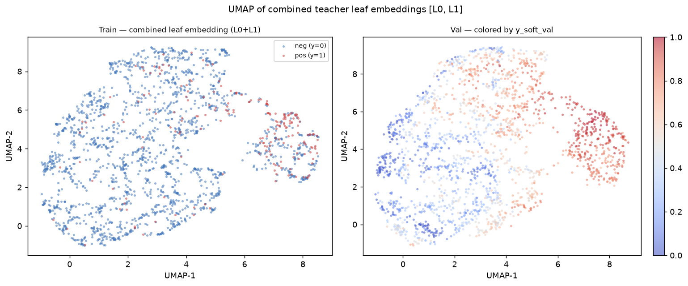

---

## Headline lambda recommendation

At the proposed headline λ=0.05: Spearman(p0,H) val = 0.9997, student R² val = 0.9913, AP(y_soft,y) val = 0.4263. The best student R² across the sweep 
occurred at λ=0.00 (R²=0.9924). 
This supports λ=0.05 as a reasonable default — it is within the swept range and does not sacrifice student learnability relative to the best-observed lambda.

---

## Limitations & future work

**In-sample teacher on train.** This experiment implements only the *simple* version: `p0` 
and `p1` predict on the same rows they were fit on to build `y_soft_train`. This risks 
`H_train` / `y_soft_train` being overly confident or overfit relative to what the teacher 
would produce on genuinely unseen rows, since in-sample residuals are systematically smaller 
than out-of-sample residuals.

**Stronger version (not implemented here): out-of-fold (OOF) teacher.** Within `df_train`, 
run K-fold cross-validation: for each fold, fit `p0`/`p1` on the other folds and predict on 
the held-out fold, stitching together `H_OOF` across all folds. Fit `F_train` on `H_OOF` 
instead of the in-sample `H_train`, giving `y_soft_train = F_train(H_OOF)`. For `df_val`, 
still use the FINAL `p0`/`p1` models fit on all of `df_train`, transformed through the same 
train-fitted `F_train` — this part is unchanged from the simple version. The OOF variant is 
documented here as the recommended next step if the simple version's results look 
promising (or suspiciously good) on `df_train`.

---

Raw data: `results.csv`, `teacher_train.parquet`, `teacher_val.parquet` (lambda=0.05)
